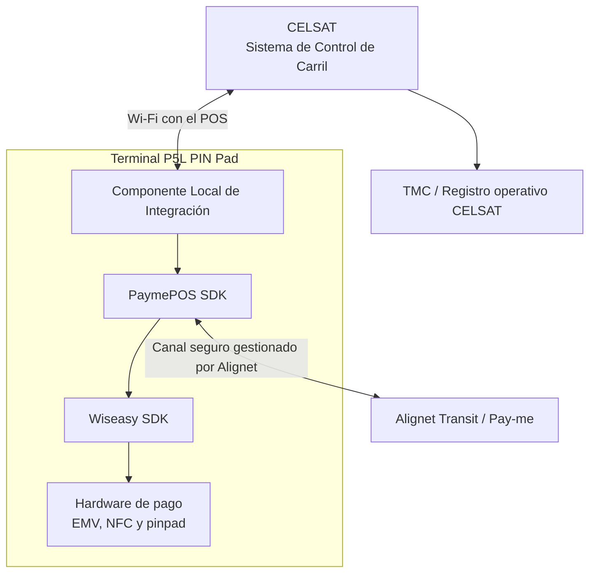
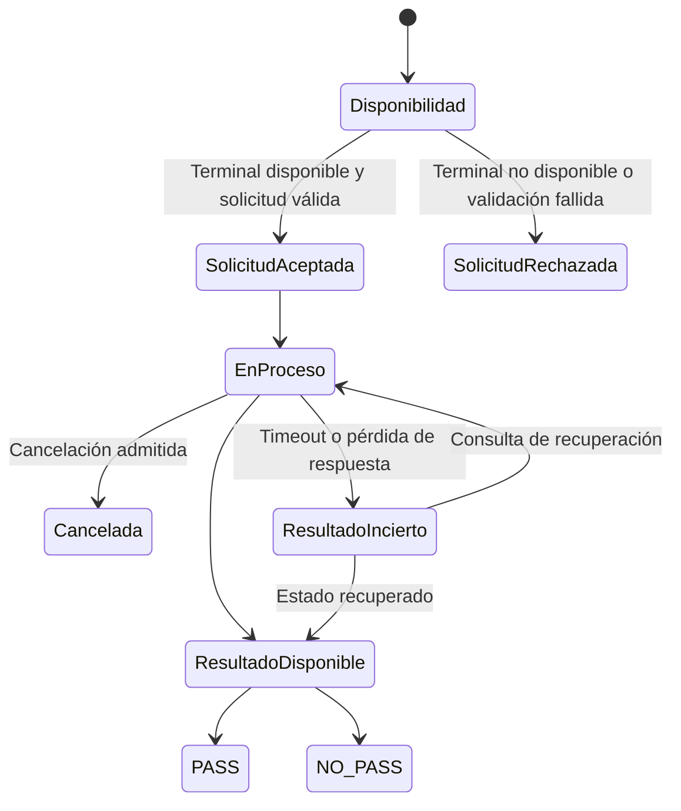
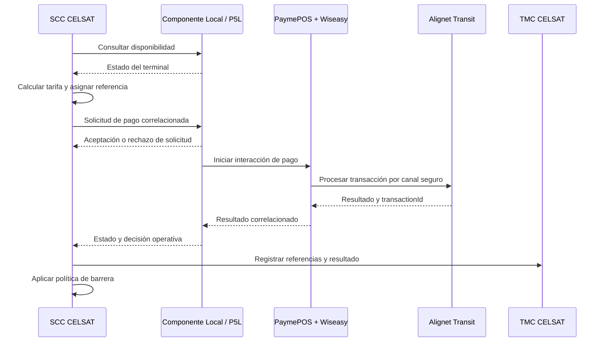
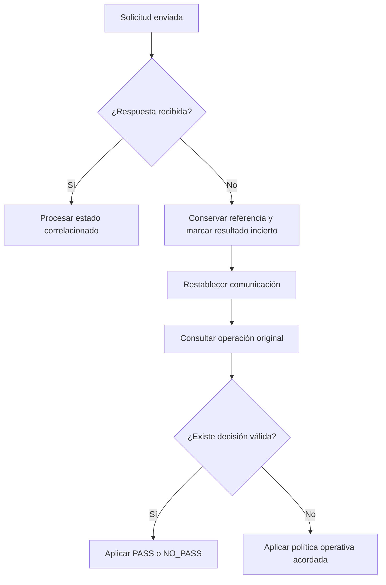

# Alignet Transit: Guía de integración CELSAT para peajes

**Clasificación:** Referencia técnica de integración  
**Audiencia:** Arquitectura, desarrollo, infraestructura, seguridad, QA y operación técnica de CELSAT  
**Versión:** 1.0  
**Fecha:** 17 de agosto de 2026

## 1. Propósito

Esta guía describe el modelo técnico de referencia para integrar el Sistema de Control de Carril de CELSAT con Alignet Transit mediante un terminal P5L PIN Pad.

Su objetivo es que CELSAT pueda:

- comprender los actores y límites de responsabilidad;
- adaptar su Sistema de Control de Carril (SCC);
- coordinar con Alignet la habilitación de la conexión Wi-Fi con el terminal;
- construir y correlacionar solicitudes de pago;
- interpretar estados y resultados;
- gestionar timeouts, reintentos y recuperación;
- registrar evidencia operativa y transaccional;
- preparar infraestructura y ambientes de integración;
- organizar sus actividades técnicas y pruebas de extremo a extremo.

La guía define el comportamiento funcional y las responsabilidades de interoperabilidad. Los valores dependientes del ambiente y los detalles de serialización se formalizan en los documentos de configuración y especificación de interfaz correspondientes.

## 2. Alcance funcional

La integración contempla:

- pagos en soles peruanos, identificados mediante el código numérico de moneda `604`;
- pagos mediante chip EMV, EMV Contactless/NFC y QR interoperable;
- uso de tarjeta y, cuando corresponda al medio contactless, teléfono o wearable;
- consulta de disponibilidad del terminal antes de iniciar una operación;
- inicio, aceptación, procesamiento y resultado de la solicitud;
- decisión operativa de carril `PASS` o `NO_PASS`;
- idempotencia y detección de solicitudes inconsistentes;
- consulta y recuperación del último estado conocido;
- cancelación cuando el estado de la operación lo permita;
- tratamiento de timeouts y resultados inciertos;
- correlación entre la referencia de CELSAT y la transacción de Alignet;
- generación del comprobante por CELSAT con los datos habilitados para ese fin;
- pruebas conjuntas en un ambiente segregado de producción.

La integración no asume autorización offline. Alignet gestiona la conectividad Wi-Fi necesaria para que el POS procese la operación.

Las operaciones financieras distintas al pago descrito, como extornos o devoluciones, se gestionan mediante sus flujos y especificaciones correspondientes y no forman parte de esta guía.

La interacción específica para QR interoperable, incluyendo presentación, confirmación y datos de respuesta aplicables, se formaliza en la especificación de interfaz. Este medio mantiene las mismas reglas de correlación, idempotencia, trazabilidad y recuperación definidas en esta guía.

## 3. Principios de integración

1. **Correlación:** cada operación del carril mantiene una referencia estable durante todo su ciclo.
2. **Idempotencia:** una retransmisión de la misma operación lógica no produce un segundo efecto financiero.
3. **Separación de estados:** la recepción de una solicitud, la decisión de barrera y el estado financiero son conceptos distintos.
4. **Recuperación antes de repetir:** ante una respuesta ausente o incierta, el SCC consulta el estado de la referencia original antes de iniciar otra operación.
5. **Configuración por ambiente:** el terminal y los timeouts se coordinan para cada ambiente.
6. **Mínima exposición:** las interfaces, logs y comprobantes incluyen únicamente la información necesaria y autorizada.
7. **Trazabilidad extremo a extremo:** CELSAT y Alignet conservan identificadores que permiten relacionar el evento del carril con la transacción procesada.

## 4. Actores y componentes

| Actor o componente | Responsabilidad funcional |
| --- | --- |
| **Sistema de Control de Carril de CELSAT (SCC)** | Detecta el evento del carril, determina la categoría, calcula la tarifa, genera la referencia de la operación, solicita el pago, interpreta la respuesta y controla la barrera conforme a la política acordada. |
| **Componente Local de Integración** | Expone al SCC la interfaz local del terminal, valida las solicitudes, coordina el flujo de pago y devuelve estados y resultados correlacionados. En otros documentos puede denominarse Agente ECR o Servicio Local de Integración. |
| **PaymePOS SDK** | Gestiona el flujo de pago de Alignet dentro del terminal, coordina la interacción con el medio de pago y se comunica con Alignet Transit. |
| **Wiseasy SDK y hardware P5L** | Presenta información en el dispositivo y opera lector EMV, NFC, pinpad y capacidades criptográficas del terminal. |
| **Alignet Transit / Pay-me** | Procesa la operación, asigna el identificador transaccional de Alignet y devuelve la información funcional habilitada para la integración. |
| **TMC o plataforma operativa de CELSAT** | Conserva el evento del carril y las referencias necesarias para operación, trazabilidad y conciliación, de acuerdo con la arquitectura de CELSAT. |

## 5. Arquitectura de referencia



### 5.1 Límites de comunicación

| Enlace | Finalidad | Naturaleza de la definición |
| --- | --- | --- |
| SCC ↔ Componente Local de Integración | Disponibilidad, inicio, seguimiento, consulta, cancelación y resultado. | Conexión Wi-Fi con el POS habilitada por Alignet. |
| Componente Local ↔ PaymePOS SDK | Entrega de la operación a la capa de pago dentro del P5L. | Interfaz interna del terminal administrada por Alignet. |
| PaymePOS SDK ↔ Wiseasy SDK | Interacción con lector, NFC, pinpad y hardware criptográfico. | Interfaz interna del terminal administrada por Alignet y Wiseasy. |
| PaymePOS SDK ↔ Alignet Transit | Procesamiento y trazabilidad transaccional. | Canal seguro administrado por Alignet. |
| SCC ↔ TMC | Registro operativo, seguimiento y conciliación del evento de carril. | Corresponde a la arquitectura de CELSAT. |

La interfaz de CELSAT termina en el Componente Local de Integración. CELSAT no necesita interactuar directamente con PaymePOS SDK, Wiseasy SDK ni con los servicios internos de Alignet Transit.

## 6. Responsabilidades de CELSAT

CELSAT es responsable de:

- adaptar el SCC para comunicarse con la interfaz local del P5L;
- detectar el vehículo, determinar su categoría y calcular la tarifa;
- generar o suministrar una referencia única para cada operación lógica;
- identificar el punto de peaje, carril y sentido de circulación;
- registrar la fecha y hora del evento con zona horaria;
- construir solicitudes conforme a la especificación de interfaz acordada;
- consultar la disponibilidad del terminal antes de iniciar el pago;
- interpretar aceptación, rechazo de solicitud, proceso, resultado, cancelación y estado incierto;
- controlar la barrera únicamente con una decisión operativa válida y conforme a la política acordada;
- conservar la referencia original ante timeouts, desconexiones o reinicios;
- consultar el último estado conocido antes de retransmitir una operación incierta;
- evitar la reutilización de una referencia para operaciones con datos diferentes;
- registrar la trazabilidad del evento en sus sistemas;
- generar e imprimir el comprobante con los datos habilitados por la respuesta;
- coordinar con Alignet la habilitación del POS y preparar el ambiente de pruebas;
- proporcionar maestros, catálogos y parámetros operativos necesarios para la configuración;
- participar en las pruebas de integración y validar el comportamiento del carril.

## 7. Responsabilidades de Alignet

Alignet es responsable de:

- proporcionar el Componente Local de Integración disponible en el P5L;
- suministrar la especificación de la interfaz SCC ↔ terminal;
- validar solicitudes y entregar respuestas correlacionadas;
- coordinar la operación del PaymePOS SDK con Wiseasy SDK y el hardware del P5L;
- procesar la transacción mediante Alignet Transit;
- asignar y devolver el identificador transaccional de Alignet cuando corresponda;
- aplicar las reglas de idempotencia del ámbito transaccional;
- exponer capacidades de consulta, recuperación y cancelación conforme al estado de la operación;
- proteger los datos administrados por sus componentes;
- proporcionar los parámetros y terminales correspondientes al ambiente de integración;
- habilitar la trazabilidad técnica necesaria para el análisis conjunto de pruebas e incidencias;
- acompañar la configuración, interoperabilidad y validación de extremo a extremo.

## 8. Responsabilidades compartidas

CELSAT y Alignet coordinan:

- disponibilidad de la conexión Wi-Fi con el POS;
- estructura versionada de mensajes y catálogo de respuestas;
- catálogos de puntos de peaje, carriles, categorías y sentidos;
- semántica operativa de `PASS`, `NO_PASS` y resultados inciertos;
- valores de timeout y reglas de recuperación;
- punto operativo hasta el cual procede una cancelación;
- comportamiento del carril ante indisponibilidad de la conexión con el POS;
- mecanismo de autenticación, integridad y protección contra replay en la interfaz local;
- datos autorizados para el comprobante;
- configuración de ambientes, datos de prueba y criterios de aceptación.

## 9. Capacidades funcionales de la interfaz local

La interfaz entre el SCC y el terminal contempla las siguientes capacidades lógicas. Los nombres de comandos, rutas, mensajes y valores de protocolo se formalizan en la especificación técnica versionada.

| Capacidad | Solicitud de CELSAT | Respuesta esperada |
| --- | --- | --- |
| **Consultar disponibilidad** | El SCC consulta si el terminal puede recibir una operación. | Estado disponible, ocupado o no disponible, según el catálogo acordado. |
| **Iniciar pago** | El SCC envía la referencia, el monto, la moneda y, cuando corresponda, datos operativos adicionales. | Aceptación de la solicitud o rechazo de validación correlacionado. |
| **Consultar operación** | El SCC solicita el último estado conocido mediante la referencia acordada. | Estado reproducible y resultado, si ya se encuentra disponible. |
| **Recibir o recuperar resultado** | El SCC recibe el resultado por el mecanismo coordinado o lo recupera mediante consulta. | Decisión operativa, referencias y datos complementarios habilitados. |
| **Solicitar cancelación** | El SCC solicita cerrar una operación que se encuentra en un estado cancelable. | Confirmación de cancelación o estado/resultado ya alcanzado. |
| **Gestionar incertidumbre** | El SCC conserva la referencia después de timeout o pérdida de comunicación. | Recuperación del último estado sin crear una operación lógica distinta. |

El mecanismo de entrega del resultado puede adoptar un patrón de consulta, notificación o conexión persistente. La opción aplicable se registra en la especificación de interfaz acordada para la integración.

## 10. Parámetros de envío

La solicitud de autorización requiere únicamente tres campos. Todos se envían como cadenas.

| Campo | Tipo | Obligatorio | Regla | Ejemplo |
| --- | --- | --- | --- | --- |
| `operationNumber` | String | Sí | Identifica una única operación lógica generada por CELSAT. | `20100008` |
| `amount` | String | Sí | Monto expresado en unidades menores, sin separador decimal. | `850` equivale a S/ 8.50 |
| `currency` | String | Sí | Código numérico ISO 4217 de la moneda. | `604` para PEN |

Trama mínima:

```json
{
  "operationNumber": "20100008",
  "amount": "850",
  "currency": "604"
}
```

La trama admite el atributo opcional `additionalFields` para enviar pares clave/valor complementarios. Incluir este atributo no agrega nuevos campos obligatorios a la autorización. CELSAT decide los nombres y valores que utilizará.

Trama con datos adicionales:

```json
{
  "operationNumber": "20100008",
  "amount": "850",
  "currency": "604",
  "additionalFields": {
    "<campo_definido_por_CELSAT>": "<valor>"
  }
}
```

Alignet no establece campos adicionales obligatorios. La especificación versionada de la interfaz define las restricciones y la envoltura final del mensaje.

## 11. Información de la respuesta

| Dato funcional | Disponibilidad | Uso de CELSAT |
| --- | --- | --- |
| `operationNumber` | En toda respuesta correlacionable. | Relacionar la respuesta con el evento original del carril. |
| `transactionId` | Cuando Alignet haya asignado el identificador transaccional. | Soporte, seguimiento y conciliación. |
| `requestStatus` | En toda respuesta. | Distinguir recepción, validación, proceso, cancelación o finalización. |
| `result` | Cuando exista una decisión operativa. | Aplicar `PASS` o `NO_PASS` según la política de barrera acordada. |
| `reasonCode` | Cuando el estado o resultado requiera una razón. | Diagnóstico y tratamiento funcional. |
| `amount` y `currency` | Cuando la solicitud haya sido reconocida. | Verificar la operación correlacionada. |
| `brand` | Cuando se encuentre disponible y habilitado. | Comprobante y registro operativo. |
| `lastFourDigits` | Cuando se encuentre disponible y su uso esté permitido. | Comprobante y registro con dato enmascarado. |

`transactionId` es asignado por Alignet y se conserva separado de `operationNumber`. Ninguno debe derivarse o reconstruirse a partir del otro.

## 12. Estados y decisión de carril

El SCC debe manejar tres dimensiones independientes:

1. **Estado de la solicitud:** informa si el mensaje fue aceptado, rechazado, se encuentra en proceso o fue cancelado.
2. **Decisión operativa:** informa `PASS` o `NO_PASS` cuando existe una decisión válida para el carril.
3. **Estado financiero:** corresponde al ciclo transaccional administrado por Alignet y no debe inferirse únicamente a partir de la decisión de carril.



Los nombres del diagrama son estados funcionales, no constantes del protocolo. La especificación de interfaz define sus códigos y transiciones técnicas.

Reglas de interpretación:

- la aceptación de una solicitud no equivale a `PASS`;
- un estado en proceso no autoriza a abrir la barrera;
- `PASS` no se deriva directamente de un código financiero aislado;
- un timeout, una desconexión o una respuesta desconocida no equivalen a `NO_PASS`;
- un código no reconocido se registra y se trata como resultado no resuelto hasta recuperar o confirmar el estado;
- la política de barrera se aplica únicamente con información válida para el estado alcanzado.

## 13. Secuencia de una operación



Secuencia esperada del lado CELSAT:

1. Consultar la disponibilidad del terminal.
2. Detectar y clasificar el vehículo.
3. Calcular el monto.
4. Asignar una referencia única a la operación lógica.
5. Construir la solicitud con datos de ubicación y evento.
6. Enviar la solicitud mediante la interfaz local acordada.
7. Registrar la aceptación o el rechazo de la solicitud.
8. Esperar o consultar la evolución sin generar una nueva referencia.
9. Interpretar la decisión operativa cuando se encuentre disponible.
10. Registrar `operationNumber`, `transactionId`, estado, resultado y razón.
11. Aplicar la política de barrera y generar el comprobante cuando corresponda.

## 14. Idempotencia y duplicados

La referencia de la operación actúa como clave de idempotencia dentro del ámbito transaccional acordado.

| Escenario | Comportamiento esperado |
| --- | --- |
| Misma referencia y mismos datos | Recuperar la operación existente sin producir un segundo efecto financiero. |
| Misma referencia con datos diferentes | Rechazar la solicitud como conflicto o inconsistencia. |
| Respuesta no recibida | Consultar la referencia original antes de retransmitir. |
| Reinicio del SCC | Recuperar las operaciones abiertas desde el almacenamiento persistente y consultar su estado. |
| Restablecimiento de la conexión | Consultar el último estado conocido antes de decidir otro envío. |

CELSAT debe persistir la referencia antes de enviar la solicitud y conservar una huella de los datos relevantes para detectar una reutilización inconsistente.

## 15. Timeouts, reintentos y recuperación

Los timeouts son parámetros de ambiente coordinados de acuerdo con las características del flujo y el mecanismo de respuesta.

Ante un timeout o pérdida de comunicación, el SCC debe:

1. conservar `operationNumber` y `transactionId`, si ya fue recibido;
2. marcar localmente la operación como no resuelta, sin convertirla en `NO_PASS`;
3. restablecer el canal de comunicación;
4. consultar el último estado de la referencia original;
5. aplicar `PASS` o `NO_PASS` únicamente cuando la consulta devuelva una decisión válida;
6. ejecutar un reintento solo conforme a la regla de idempotencia y recuperación acordada;
7. escalar el caso según el procedimiento operativo si el estado continúa sin resolución.



Una indisponibilidad de la conexión no debe interpretarse automáticamente como aprobación, rechazo ni habilitación offline.

## 16. Cancelación

CELSAT puede solicitar la cancelación de una operación cuando el estado lo permita. La respuesta debe indicar uno de los siguientes resultados funcionales:

- cancelación aceptada;
- cancelación no aplicable por el estado alcanzado;
- operación con resultado ya disponible.

El punto de no retorno y los códigos aplicables se formalizan en la especificación de interfaz. Si la respuesta de cancelación es incierta, CELSAT debe consultar la operación original antes de iniciar otra solicitud.

## 17. Manejo de errores y respuestas desconocidas

CELSAT debe contemplar, como mínimo, las siguientes categorías:

| Categoría | Tratamiento esperado en el SCC |
| --- | --- |
| Validación de solicitud | Corregir los datos antes de un nuevo intento. No reutilizar la referencia con un payload diferente salvo que la especificación lo autorice expresamente. |
| Terminal ocupado o no disponible | No iniciar el pago y aplicar la política operativa del carril. |
| Operación duplicada consistente | Recuperar y continuar el seguimiento de la operación existente. |
| Operación duplicada inconsistente | Registrar el conflicto y no tratarla como una operación nueva. |
| Pérdida de comunicación | Conservar la referencia y ejecutar el flujo de consulta y recuperación. |
| Timeout o resultado incierto | No inferir `NO_PASS`; consultar el estado. |
| Código o estado desconocido | Registrar el valor original, no asumir su semántica y tratar la operación como no resuelta. |
| Error de autenticación o seguridad | Detener el envío, proteger la evidencia y escalar por el canal técnico acordado. |

El catálogo versionado de `reasonCode`, errores y estados indicará cuáles son recuperables, cuáles requieren corrección de datos y cuáles deben escalarse.

## 18. Conectividad con el POS

Alignet gestiona la conexión Wi-Fi necesaria para que el SCC se comunique con el terminal P5L y para que el POS procese la operación. CELSAT participa en la verificación funcional de esta conexión durante las pruebas.

### 18.1 Sincronización horaria

SCC y terminal deben mantener relojes sincronizados. CELSAT conserva la hora del evento, envío, recepción y aplicación de la respuesta para trazabilidad y análisis de latencia.

## 19. Seguridad

La integración aplica los siguientes principios:

- segregación entre ambientes de integración y producción;
- protección de las comunicaciones administradas por Alignet;
- aplicación del principio de mínimo privilegio;
- exclusión de PAN completo, datos de chip y material criptográfico de logs, comprobantes y tickets de soporte;
- enmascaramiento de datos de tarjeta cuando su uso se encuentre habilitado;
- conservación de evidencia técnica suficiente sin exponer datos sensibles.

## 20. Trazabilidad y logging de CELSAT

Para cada operación, CELSAT debe registrar, cuando estén disponibles:

- referencia de CELSAT (`operationNumber`);
- identificador de Alignet (`transactionId`);
- punto de peaje y carril;
- categoría y sentido;
- monto y moneda;
- fecha y hora del evento con zona;
- fecha y hora de envío y recepción;
- estado de solicitud;
- decisión operativa;
- código de razón;
- número de intento o evento de recuperación;
- eventos de conexión, desconexión y timeout;
- versión del contrato de interfaz;
- identificador técnico del terminal, cuando corresponda;
- resultado de impresión o registro del comprobante.

Los logs deben permitir reconstruir la secuencia sin registrar PAN completo, datos EMV sensibles ni llaves. La política de retención, acceso y anonimización se alinea con las normas de seguridad y operación de ambas organizaciones.

## 21. Configuración por ambiente

| Grupo | Parámetros típicos | Responsable de suministrar o coordinar |
| --- | --- | --- |
| Interfaz local | Timeouts y versión del contrato. | Alignet y CELSAT. |
| Conectividad del POS | Habilitación de la conexión Wi-Fi. | Alignet. |
| Terminal | Serial y asociación del dispositivo. | Alignet, con la información operativa de CELSAT. |
| Operación | Moneda, zona horaria y datos adicionales definidos por CELSAT. | CELSAT y Alignet. |
| Recuperación | Timeouts, frecuencia de consulta, límites de reintento y escalamiento. | Alignet y CELSAT. |
| Evidencia | Niveles de log, correlación, retención y canales de soporte. | Alignet y CELSAT. |

Los valores específicos se registran en una ficha de configuración por ambiente y se intercambian mediante el canal apropiado para su sensibilidad.

## 22. Preparación técnica de CELSAT

La lectura de esta guía permite a CELSAT organizar los siguientes frentes de trabajo:

1. Inventariar la arquitectura y runtime del SCC.
2. Definir la adaptación del SCC para consumir la interfaz local del P5L.
3. Coordinar con Alignet la habilitación de la conexión Wi-Fi con el POS.
4. Incorporar la construcción y validación de solicitudes.
5. Implementar la interpretación de estados, resultados y razones.
6. Persistir referencias y correlación transaccional.
7. Aplicar idempotencia y tratamiento de duplicados.
8. Incorporar consulta, timeout, recuperación y cancelación.
9. Registrar logs y evidencia sin datos sensibles.
10. Integrar el resultado con la lógica de barrera, TMC y comprobante.
11. Preparar configuración y datos del ambiente de integración.
12. Ejecutar pruebas de contrato y validación de extremo a extremo.

## 23. Pruebas de integración

### 23.1 Preparación

Antes de ejecutar las pruebas conjuntas, ambas partes verifican:

- especificación de interfaz y catálogos versionados;
- conexión Wi-Fi con el POS habilitada por Alignet;
- ambiente Alignet Transit accesible;
- terminales P5L asociados al comercio y carril de prueba;
- software y material criptográfico correspondientes al ambiente;
- SCC o simulador de CELSAT disponible;
- datos de prueba y referencias controladas;
- sincronización horaria;
- logs y canales de soporte habilitados.

### 23.2 Escenarios mínimos

| Escenario | Resultado a validar |
| --- | --- |
| Pago exitoso con chip EMV | `PASS` y correlación `operationNumber` ↔ `transactionId`. |
| Pago exitoso contactless | `PASS` y correlación completa. |
| Pago exitoso con QR interoperable | `PASS`, correlación completa y evidencia del flujo QR. |
| Operación no aceptada | `NO_PASS` y razón funcional cuando corresponda. |
| Referencia duplicada con mismos datos | Recuperación de la misma operación, sin doble efecto. |
| Referencia duplicada con datos diferentes | Conflicto o rechazo de validación. |
| Pérdida del enlace local | Recuperación posterior sin duplicidad. |
| Cancelación en estado permitido | Confirmación de cancelación. |
| Terminal no disponible | Detección preventiva y pago no iniciado. |
| Timeout o resultado incierto | Consulta y recuperación sin inferir rechazo. |
| Operaciones en múltiples carriles | Independencia y correlación por carril. |
| Comprobante y trazabilidad | Consistencia entre respuesta, ticket y registros. |
| Reinicio del SCC o del terminal | Recuperación de operaciones abiertas conforme al procedimiento acordado. |

### 23.3 Criterios de aceptación

- CELSAT y Alignet correlacionan cada operación mediante sus dos identificadores.
- Los reintentos y reconexiones no generan duplicidad financiera.
- Los estados desconocidos y resultados inciertos siguen el flujo de recuperación.
- Cada operación queda asociada al terminal que la procesó.
- La evidencia permite reconstruir cada escenario sin exponer información sensible.
- La lógica de barrera responde a la decisión operativa acordada.
- Ambas partes revisan los resultados y registran la conformidad de las pruebas.

## 24. Puntos de coordinación técnica

La integración se formaliza mediante los siguientes artefactos compartidos:

1. **Especificación de interfaz:** transporte, mensajes, schemas, estados, errores, versionado y mecanismo de resultado.
2. **Ficha de habilitación:** terminales participantes y disponibilidad de la conexión Wi-Fi.
3. **Ficha de parametrización:** comercio, terminales, peajes, carriles, categorías, sentidos y zona horaria.
4. **Política operativa:** timeout, recuperación, cancelación, contingencia de conexión y uso de `PASS`/`NO_PASS`.
5. **Plan de pruebas:** escenarios, datos, evidencias, responsables de ejecución y criterios de aceptación.
6. **Procedimiento de soporte:** canales, datos mínimos de diagnóstico, severidades y escalamiento.

La coordinación de estos valores no modifica la arquitectura ni las responsabilidades descritas en esta guía; permite ajustarlas a la infraestructura y operación concreta de CELSAT.

## 25. Resumen para el equipo técnico de CELSAT

CELSAT se integra con una única interfaz local disponible en el terminal P5L. El SCC consulta el terminal, envía una operación correlacionada, sigue su estado y recibe o recupera una decisión operativa. Alignet administra el flujo de pago dentro del terminal y el procesamiento con Alignet Transit.

Para integrarse correctamente, CELSAT debe preparar los datos operativos, la persistencia de referencias, la interpretación de estados, la recuperación ante incertidumbre, los logs, la lógica de barrera y el ambiente de pruebas. Alignet gestiona la conexión Wi-Fi con el POS. Los valores particulares del protocolo se registran durante la habilitación de cada ambiente y en la especificación de interfaz acordada.
