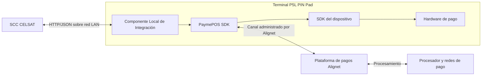

# Alignet Transit: guía de integración CELSAT

**Versión:** 1.1

**Audiencia:** Arquitectura, desarrollo, QA y operación técnica de CELSAT

**Alcance:** Autorización de pago y consulta de estado mediante el terminal P5L

## 1. Objetivo

Esta guía consolida la integración entre el Sistema de Control de Carril de CELSAT (SCC) y la solución Alignet Transit. El SCC inicia una autorización de pago mediante el Componente Local de Integración instalado en el terminal P5L y recibe una respuesta normalizada.

CELSAT no necesita conocer estructuras internas de PaymePOS SDK, mensajes ISO 8583, datos EMV ni información sensible de tarjeta.

La arquitectura, las responsabilidades, los endpoints y los mensajes descritos se consideran estables. La URL base, el mecanismo de autenticación, los timeouts y otros valores del ambiente están sujetos a validación final durante la habilitación de integración.

## 2. Arquitectura



El Componente Local constituye la única frontera técnica consumida por CELSAT.

## 3. Componentes y responsabilidades

| Componente | Responsabilidad |
| --- | --- |
| SCC CELSAT | Calcular el importe, generar `operationNumber`, invocar la interfaz, interpretar la respuesta y aplicar la política del carril. |
| Componente Local | Exponer los endpoints HTTP, validar la solicitud, invocar PaymePOS SDK y normalizar la respuesta. |
| PaymePOS SDK | Coordinar el flujo transaccional con el dispositivo y la plataforma. |
| SDK del dispositivo | Operar las capacidades del P5L y la interacción con el medio de pago. |
| Plataforma de pagos Alignet | Procesar la autorización, asignar `transactionID` y devolver el resultado financiero. |
| Procesador y redes de pago | Autorizar o denegar la operación. |

## 4. Operaciones expuestas al SCC

| Operación | Método y ruta |
| --- | --- |
| Autorizar pago | `POST /api/v1/payments` |
| Consultar estado | `GET /api/v1/payments/{operationNumber}` |

Los endpoints de cancelación o extorno no forman parte de esta especificación de autorización. Cualquier interfaz adicional requiere confirmación y documentación versionada.

## 5. Solicitud de autorización

### Headers

```http
Content-Type: application/json
Accept: application/json
```

### Campos

| Campo | Tipo | Requerido | Descripción |
| --- | --- | --- | --- |
| `operationNumber` | String | Sí | Identificador único de la operación generado por CELSAT. |
| `amount` | String | Sí | Cadena numérica que representa el monto en unidades menores. |
| `currency` | String | Sí | Código numérico ISO 4217. Para PEN utiliza `604`. |
| `additionalFields` | Object | No | Información complementaria asociada a la operación. |

Los tres primeros campos son requeridos. `additionalFields` es opcional y no reemplaza ninguno de ellos.

```json
{
  "operationNumber": "OP-20260821-000001",
  "amount": "1500",
  "currency": "604"
}
```

`amount` se envía como una cadena numérica sin separadores. S/ 15.00 se representa como `"1500"`.

### Información adicional para CELSAT

Cuando se incluya `additionalFields`, debe contener las tres claves acordadas.

| Campo | Tipo JSON | Requerido dentro del objeto | Formato | Uso |
| --- | --- | --- | --- | --- |
| `montoPeaje` | String | Sí | Decimal(12,2): hasta 10 dígitos enteros y 2 decimales | Importe correspondiente al peaje. |
| `montoDetraccion` | String | Sí | Decimal(12,2): hasta 10 dígitos enteros y 2 decimales | Importe correspondiente a la detracción. Usa `"0.00"` cuando no aplique. |
| `IdTurnoVia` | String | Sí | Máximo 50 caracteres | Agrupación y conciliación por turno o vía. |

```json
{
  "operationNumber": "OP-20260822-000001",
  "amount": "1500",
  "currency": "604",
  "additionalFields": {
    "montoPeaje": "10.00",
    "montoDetraccion": "5.00",
    "IdTurnoVia": "TV-20260822-001"
  }
}
```

Los nombres de las claves distinguen mayúsculas de minúsculas. `amount` utiliza unidades menores, mientras `montoPeaje` y `montoDetraccion` se expresan con dos posiciones decimales. Cuando se envía esta información, la respuesta la conserva dentro de `result.additionalFields`.

## 6. Reglas de `operationNumber`

- Debe ser único por venta.
- Debe generarse y persistirse antes del `POST`.
- No debe reutilizarse para otra venta.
- Debe conservarse hasta conocer el resultado final.
- Ante timeout o pérdida de comunicación, se consulta usando el mismo valor.

```text
1 venta = 1 operationNumber
```

## 7. Respuesta normalizada

```json
{
  "success": true,
  "resultCode": "00",
  "resultMessage": "Se procesó correctamente la petición",
  "result": {
    "transactionID": "6f55a89d-bba1-4db7-bbc7-004011e0978d",
    "operationNumber": "OP-20260822-000001",
    "state": "AUTORIZADO",
    "stateReason": "Approved",
    "amount": "1500",
    "currency": "604",
    "additionalFields": {
      "montoPeaje": "10.00",
      "montoDetraccion": "5.00",
      "IdTurnoVia": "TV-20260822-001"
    },
    "paymentMethod": {
      "name": "CARD",
      "maskedPan": "411111******1111",
      "brand": "VISA"
    },
    "processor": {
      "authorizationCode": "123456",
      "responseCode": "00"
    }
  }
}
```

### Campos principales

| Campo | Tipo | Descripción |
| --- | --- | --- |
| `success` | Boolean | Indica si el flujo pudo procesarse y producir una respuesta. |
| `resultCode` | String | Código general del backend o del procesamiento local. |
| `resultMessage` | String | Mensaje legible asociado al código. |
| `result` | Object / null | Datos de la transacción cuando existen. |

`success = true` no equivale a pago aprobado. El pago solo se confirma cuando:

```text
result.state = AUTORIZADO
```

### Campos de `result`

| Campo | Tipo | Descripción |
| --- | --- | --- |
| `transactionID` | String | Identificador único generado por Alignet. |
| `operationNumber` | String | Identificador enviado por CELSAT. |
| `state` | String | Estado financiero. |
| `stateReason` | String | Razón o descripción del procesador o emisor. |
| `amount` | String | Monto procesado en unidades menores. |
| `currency` | String | Código numérico ISO 4217. |
| `additionalFields` | Object / null | Información adicional enviada por CELSAT y asociada a la operación. |
| `paymentMethod` | Object / null | Información no sensible del medio de pago. |
| `processor` | Object / null | Información normalizada del procesador. |
| `lifecycle` | Array | Historial de estados, cuando se encuentre disponible. |

## 8. Estados financieros

| Estado | Final | Acción del SCC |
| --- | --- | --- |
| `AUTORIZADO` | Sí | Confirmar el pago. |
| `DENEGADO` | Sí | Informar el rechazo. |
| `PENDIENTE` | No | Consultar el estado. |
| `INVALIDO` | Sí | Registrar y tratar el error. |
| `CANCELADO` | Sí | Registrar la cancelación. |
| `EXPIRADO` | Sí | Registrar la expiración. |
| `EXTORNADO` | Sí | Confirmar el extorno. |

## 9. Códigos de resultado

### Procesador o backend

| Código | Nombre | Significado |
| --- | --- | --- |
| `00` | `SUCCESS` | Transacción aprobada. |
| `01` | `DENIED` | Transacción rechazada por el procesador o emisor. |
| `03` | `INTERNAL_ERROR` | Error interno del backend. |
| `04` | `NO_PROCESSED` | El backend no pudo completar la operación. |
| `06` | `BAD_REQUEST` | Error de validación de la solicitud. |
| `08` | `MERCHANT_BAD_CONFIG` | Configuración del comercio incompleta o inválida. |

### P5L y SDK

| Código | Nombre | Significado |
| --- | --- | --- |
| `14` | `ABANDONED` | El usuario canceló antes de presentar la tarjeta. |
| `15` | `ABANDONED_ONE_INTENT` | El usuario canceló después de uno o más intentos. |
| `P01` | `DEVICE_NOT_REGISTERED` | Dispositivo no registrado. |
| `P02` | `DEVICE_BAD_CONFIG` | Configuración requerida ausente. |
| `P03` | `DEVICE_INTERNAL_ERROR` | Error interno del SDK. |
| `P04` | `DEVICE_NO_INITIALIZED` | SDK no inicializado. |
| `P05` | `DEVICE_LOW_BATTERY` | Batería insuficiente. |
| `P06` | `DEVICE_NO_PRINTER` | Impresora no detectada. |
| `P07` | `DEVICE_NO_PAPER` | Impresora sin papel. |
| `P20` | `REVERSAL_CARD_MISMATCH` | La tarjeta no corresponde al extorno. |
| `P21` | `REVERSAL_INVALID_STATE` | La operación no admite extorno. |

`P20` y `P21` pertenecen al flujo de extorno y no a la autorización normal.

## 10. Consulta y recuperación

Ante timeout, pérdida de comunicación o `state = PENDIENTE`, el SCC consulta:

```http
GET /api/v1/payments/{operationNumber}
```

El SCC debe conservar la referencia original, restablecer la comunicación y consultar antes de generar otra venta.

```text
Incorrecto
OP001 → POST → timeout → crear OP002 → POST

Correcto
OP001 → POST → timeout → GET /api/v1/payments/OP001
```

Los timeouts y la frecuencia de consulta son parámetros sujetos a ajuste durante las pruebas de integración. No deben implementarse reintentos automáticos ilimitados.

## 11. Datos sensibles

CELSAT puede recibir información no sensible como PAN enmascarado, marca, código de autorización y código de respuesta.

CELSAT nunca recibe:

- PAN completo;
- CVV;
- PIN o PIN Block;
- Track 1 o Track 2;
- datos EMV sensibles.

## 12. Parámetros del ambiente

Los siguientes valores se confirman durante la habilitación final:

- URL base del Componente Local;
- mecanismo de autenticación;
- timeouts de conexión y lectura;
- frecuencia y límite de consultas;
- direccionamiento del P5L en la LAN;
- asociación entre SCC, carril y terminal.

Estos valores permanecen desacoplados del contrato para permitir ajustes menores sin modificar la arquitectura ni los mensajes.

## 13. Pruebas mínimas

- pago autorizado;
- pago denegado;
- solicitud inválida;
- configuración de comercio inválida;
- cancelación antes de presentar la tarjeta;
- cancelación después de un intento;
- errores de dispositivo `P01` a `P07`;
- estado `PENDIENTE` y consulta;
- timeout del `POST` y recuperación por `GET`;
- pérdida y recuperación de la LAN;
- reinicio del SCC con operaciones abiertas;
- respuesta o código desconocido;
- validación de ausencia de datos sensibles.

## 14. Criterios de aceptación

- La solicitud contiene tres campos requeridos y admite `additionalFields` como objeto opcional.
- `amount` se envía como una cadena numérica que representa un entero en unidades menores.
- La respuesta conserva la información adicional asociada dentro de `result.additionalFields`.
- El SCC confirma pagos únicamente con `state = AUTORIZADO`.
- `success = true` no se interpreta como aprobación.
- Las operaciones inciertas se consultan antes de otro cobro.
- Los identificadores permiten correlacionar la evidencia.
- Los códigos locales y del procesador producen el tratamiento esperado.
- Los parámetros del ambiente se encuentran registrados y validados.
