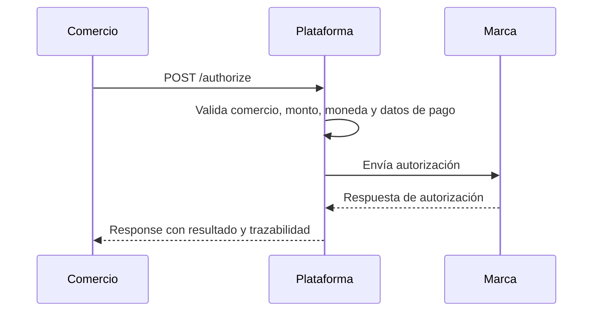
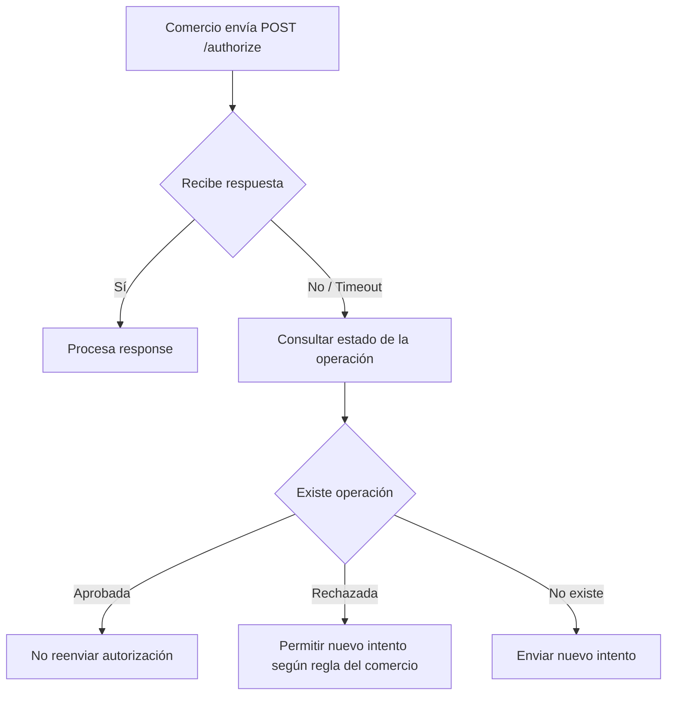

Esta página reúne las principales recomendaciones técnicas y operativas para integrar correctamente el servicio de autorización mediante el endpoint `POST /authorize`.

Aplica para los canales:

- Ecommerce
- POS

## Endpoint

```http
POST /authorize
```

## Alcance

El servicio de autorización permite procesar transacciones de pago enviadas por un comercio, terminal, PinPad, checkout o integración server-to-server.

La autorización puede originarse desde distintos canales según el valor enviado en `frame_type`.

| Canal | Valor `frame_type` | Descripción |
| --- | --- | --- |
| Ecommerce | `ecommerce` | Transacción no presencial. Aplica para checkout web, mobile checkout, link de pago o integración server-to-server. |
| POS | `pos` | Transacción presencial. Aplica para terminal POS, PinPad, Android POS o captura física de tarjeta. |

---

## Flujo general de autorización



---

## Pasos del flujo

| Paso | Descripción |
| --- | --- |
| 1 | El comercio genera una orden de compra o una operación de pago. |
| 2 | El comercio captura u obtiene los datos de pago según el canal. |
| 3 | El comercio construye la trama de autorización. |
| 4 | El comercio invoca el endpoint `POST /authorize`. |
| 5 | La plataforma valida la estructura, el comercio, la moneda, el monto y los datos enviados. |
| 6 | La plataforma procesa la transacción con la marca correspondiente. |
| 7 | La plataforma devuelve la respuesta de autorización. |
| 8 | El comercio almacena los identificadores de trazabilidad. |

---

## Canales soportados

| Canal | Uso recomendado |
| --- | --- |
| Ecommerce | Pagos en checkout web, mobile checkout, link de pago o integración directa desde backend. |
| POS | Pagos presenciales con lectura de tarjeta física, chip, contactless, banda magnética o entrada manual. |

---

## Marcas soportadas

| Valor | Marca |
| --- | --- |
| `visa` | Visa |
| `mscd` | Mastercard |

---

## Monedas soportadas

El campo de moneda debe enviarse en formato ISO 4217 numérico.

| Moneda | Código ISO 4217 numérico |
| --- | --- |
| PEN | `604` |
| USD | `840` |

---

## Formato de montos

Todos los montos deben enviarse sin punto decimal, sin separadores de miles y como string.

El monto se calcula aplicando el exponente de la moneda.

```text
Monto enviado = monto real × 10^exponente de la moneda
```

Ejemplo para moneda PEN:

| Monto real | Código moneda | Valor enviado |
| --: | --- | --: |
| 10.00 | `604` | `1000` |
| 389.80 | `604` | `38980` |
| 1,250.50 | `604` | `125050` |
| 50,000.00 | `604` | `5000000` |

---

## Ejemplos incorrectos de monto

| Valor enviado | Motivo |
| --- | --- |
| `389.80` | No debe enviarse con punto decimal. |
| `1,250.50` | No debe enviarse con separador de miles ni punto decimal. |
| `S/ 389.80` | No debe enviarse con símbolo de moneda. |
| `38980.00` | No debe enviarse con decimales. |

---

## Ejemplos correctos de monto

| Monto real | Valor correcto |
| --: | --: |
| 1.00 | `100` |
| 10.50 | `1050` |
| 389.80 | `38980` |
| 1,250.50 | `125050` |

---

## Identificador de operación

El campo `internal_operation_number` identifica la operación del comercio.

Debe ser único por comercio y debe mantenerse para consultas, trazabilidad, soporte y conciliación.

| Campo | Descripción |
| --- | --- |
| `internal_operation_number` | Referencia o número de orden generado por el comercio. |
| `transaction.meta.internal_operation_number` | Referencia o número de operación enviado en tramas POS. |

---

## Reglas para `internal_operation_number`

| Regla | Descripción |
| --- | --- |
| Unicidad | Debe ser único por comercio. |
| Longitud | Debe cumplir la longitud definida en la guía del canal correspondiente. |
| Trazabilidad | Debe poder relacionarse con la orden o venta del comercio. |
| Reutilización | No debe reutilizarse para una nueva compra. |

---

## Idempotencia y duplicidad

El campo `internal_operation_number` permite controlar la duplicidad de operaciones.

No se recomienda reutilizar el mismo identificador de operación para más de una autorización, ya que puede generar rechazos por duplicidad o inconsistencias en la conciliación.

| Escenario | Recomendación |
| --- | --- |
| Nueva compra | Generar un nuevo `internal_operation_number`. |
| Reintento por timeout | Consultar primero el estado de la operación antes de enviar una nueva autorización. |
| Error de validación | Corregir la trama y reenviar solo si la operación no fue procesada. |
| Operación aprobada | No reenviar la misma operación. |
| Operación rechazada | Permitir nuevo intento según la regla del comercio. |

---

## Datos sensibles

Los datos sensibles de tarjeta deben enviarse cifrados antes de invocar el servicio de autorización.

| Campo | Canal | Cifrado requerido |
| --- | --- | --- |
| `card.pan` | Ecommerce | Sí |
| `card.expiry_date` | Ecommerce | Sí |
| `card.security_code` | Ecommerce | Sí |
| `payment_method.card[].pan` | POS | Sí |
| `payment_method.card[].expiry_date` | POS | Sí |
| `payment_method.card[].card_sequence_number` | POS | Sí, cuando aplique |

---

## Información que no debe enviarse en campos libres

No se debe enviar información sensible dentro de campos libres como `metadata` o `additional_fields`.

| Tipo de información | Puede enviarse en metadata |
| --- | --- |
| Número de tarjeta | No |
| CVV o código de seguridad | No |
| Fecha de expiración | No |
| PIN o PIN block | No |
| Documento de identidad sensible | No |
| Número de pedido | Sí |
| Código de sucursal | Sí |
| Canal de venta | Sí |
| Identificador de carrito | Sí |
| Código de vendedor | Sí |

---

## Uso recomendado de `metadata`

El campo `metadata` permite enviar información adicional del comercio para fines de trazabilidad, reportería o conciliación.

```json
{
  "metadata": {
    "sucursal": "Sucursal 1",
    "canal": "web",
    "numero_pedido": "PED-123456",
    "codigo_vendedor": "VEN-001"
  }
}
```

| Campo sugerido | Uso |
| --- | --- |
| `sucursal` | Identificar la tienda, agencia o punto de venta. |
| `canal` | Identificar el canal de origen de la operación. |
| `numero_pedido` | Relacionar la transacción con el pedido del comercio. |
| `codigo_vendedor` | Identificar al vendedor o asesor asociado. |
| `identificador_carrito` | Relacionar la operación con un carrito de compra. |

---

## Uso recomendado de `additional_fields`

En POS, el objeto `transaction.meta.additional_fields` permite enviar información complementaria de la operación.

```json
{
  "transaction": {
    "currency": "604",
    "amount": "5000000",
    "meta": {
      "internal_operation_number": "123554",
      "additional_fields": {
        "sucursal": "Sucursal 1",
        "terminal_logical_id": "TERM-001"
      }
    }
  }
}
```

---

## Timeout y reintentos

Si el comercio no recibe respuesta por timeout o error de comunicación, no debe asumir automáticamente que la operación fue rechazada.

En estos casos, se recomienda consultar el estado de la operación antes de enviar una nueva autorización.

| Caso | Acción recomendada |
| --- | --- |
| Timeout sin respuesta | Consultar estado antes de reintentar. |
| Error HTTP | Validar si la operación fue registrada. |
| Respuesta aprobada | No reenviar la misma operación. |
| Respuesta rechazada | Permitir nuevo intento según regla del comercio. |
| Sin registro de operación | Generar un nuevo intento según la política del comercio. |

---

## Flujo recomendado ante timeout



---

## Campos recomendados para almacenamiento

El comercio debe almacenar los identificadores de respuesta necesarios para consultas, reversos, soporte, conciliación y trazabilidad.

| Campo | Uso recomendado |
| --- | --- |
| `tk_transaction_identifier` | Identificador único interno de la transacción. |
| `authorization_identification_response` | Código de autorización de la operación. |
| `retrieval_reference_code` | Trazabilidad, soporte y conciliación. |
| `system_trace_audit` | Identificador STAN para seguimiento operativo. |
| `brand_transaction_identifier` | Identificador asignado por la marca. |
| `response_code` | Validación del resultado de la operación. |
| `date_settlement` | Fecha estimada de liquidación. |
| `internal_operation_number` | Relación con la orden del comercio. |

---

## Uso operativo de los identificadores

| Identificador | Uso |
| --- | --- |
| `tk_transaction_identifier` | Consultas internas dentro de la plataforma. |
| `brand_transaction_identifier` | Validaciones con la marca. |
| `authorization_identification_response` | Confirmación de autorización aprobada. |
| `retrieval_reference_code` | Conciliación, soporte y seguimiento operativo. |
| `system_trace_audit` | Auditoría y rastreo transaccional. |
| `date_settlement` | Estimación de liquidación. |

---

## Interpretación general del response

Una autorización aprobada debe validar tanto la respuesta de la marca como el estado interno de la plataforma.

| Campo | Valor esperado | Interpretación |
| --- | --- | --- |
| `success` | `true` | La petición fue procesada por el servicio. |
| `processor_response.message.code` | `00` | La marca respondió con aprobación. |
| `processor_response.response_code` | `00` | Código ISO de aprobación. |
| `meta.status.code` | `success_operation` | Estado interno exitoso. |

---

## Estados internos referenciales

Los siguientes estados son referenciales y pueden variar según la configuración del servicio.

| Estado | Descripción |
| --- | --- |
| `success_operation` | La operación fue procesada correctamente. |
| `invalid_request` | La petición contiene campos inválidos o incompletos. |
| `merchant_not_found` | El comercio no fue encontrado. |
| `merchant_disabled` | El comercio no se encuentra habilitado para operar. |
| `duplicated_operation` | La referencia de operación ya fue utilizada. |
| `processor_error` | Ocurrió un error al procesar la operación con la marca o procesador. |
| `timeout` | No se recibió respuesta dentro del tiempo esperado. |

---

## Errores comunes

| Escenario | Causa probable | Acción recomendada |
| --- | --- | --- |
| Monto incorrecto | El monto fue enviado con decimales o separadores | Enviar el monto sin punto decimal. Ejemplo: `389.80` debe enviarse como `38980`. |
| Comercio no habilitado | El `merchant_identifier` no existe o no está activo | Validar el comercio en el proceso de onboarding. |
| Marca inválida | Se envió un valor distinto a `visa` o `mscd` | Validar el valor del campo `brand`. |
| Operación duplicada | El `internal_operation_number` ya fue utilizado | Generar una nueva referencia única por comercio o consultar la operación original. |
| Datos de tarjeta inválidos | Los campos sensibles no fueron cifrados correctamente | Verificar el mecanismo de cifrado antes de enviar la autorización. |
| Datos EMV incompletos | La operación POS chip/contactless no envió `icc_related_data` | Enviar los campos EMV obligatorios cuando aplique. |
| Moneda inválida | Se envió una moneda no soportada o con formato incorrecto | Enviar el código ISO 4217 numérico. |
| Terminal no reconocido | El `terminal_id` no existe o no está habilitado | Validar el registro del terminal. |

---

## Validaciones previas recomendadas

Antes de enviar una autorización, se recomienda validar los siguientes puntos.

| Validación | Ecommerce | POS |
| --- | --- | --- |
| Comercio activo | Sí | Sí |
| Marca válida | Sí | Sí |
| Monto sin decimales | Sí | Sí |
| Moneda en ISO 4217 numérico | Sí | Sí |
| Identificador de operación único | Sí | Sí |
| Datos sensibles cifrados | Sí | Sí |
| Terminal habilitado | No aplica | Sí |
| Modo de captura correcto | No aplica | Sí |
| Datos EMV completos | No aplica | Sí, si es chip/contactless |
| Datos 3DS válidos | Sí, si aplica | No aplica |

---

## Recomendaciones Ecommerce

| Recomendación | Descripción |
| --- | --- |
| Enviar email del tarjetahabiente | Usar `card_holder.email_address` cuando esté disponible para trazabilidad y soporte. |
| Enviar datos 3DS | Enviar `authentication.3d_secure` cuando la operación haya pasado por autenticación. |
| Usar metadata | Registrar datos como sucursal, canal, número de pedido o identificador de carrito. |
| Mantener referencia única | Alinear `internal_operation_number` con la orden del comercio. |
| No enviar datos sensibles | No incluir PAN, CVV o datos cifrados dentro de `metadata`. |

---

## Recomendaciones POS

| Recomendación | Descripción |
| --- | --- |
| Validar modo de captura | `pan_entry_mode` debe reflejar el método real de captura de la tarjeta. |
| Enviar datos EMV | Para operaciones chip o contactless EMV, debe enviarse `icc_related_data`. |
| Validar terminal | `terminal_id` debe corresponder a un terminal registrado y habilitado. |
| Enviar PIN cuando aplique | Si la operación requiere PIN, debe enviarse `pin_block`. |
| No mezclar contextos | No enviar datos EMV cuando la captura sea manual o banda magnética, salvo que aplique según configuración del terminal. |

---

## Reglas para POS según tipo de captura

| Tipo de captura | `pan_entry_mode` | Requiere `icc_related_data` | Requiere `pin_block` |
| --- | --- | --- | --- |
| Manual | `01` | No | No, salvo regla del comercio o emisor |
| Chip | `05` | Sí | Sí, si aplica |
| Contactless EMV | `07` | Sí | Según reglas de monto, comercio o emisor |
| Banda magnética | `90` | No | Sí, si aplica |

---

## Buenas prácticas de integración

| Buena práctica | Descripción |
| --- | --- |
| Validar campos obligatorios | El comercio debe validar la trama antes de enviarla. |
| No almacenar datos sensibles | No almacenar PAN, CVV, fecha de expiración ni PIN. |
| Registrar request y response | Registrar información útil para soporte, excluyendo datos sensibles. |
| Guardar identificadores | Almacenar los identificadores de trazabilidad devueltos en la respuesta. |
| Manejar timeout | Implementar consulta posterior antes de reintentar una autorización. |
| Evitar duplicidad | No duplicar autorizaciones ante errores de comunicación. |
| Usar metadata correctamente | Enviar solo información operativa o comercial no sensible. |
| Separar flujos | Diferenciar Ecommerce y POS según el valor de `frame_type`. |
| Validar montos | Enviar montos sin decimales y con moneda correcta. |
| Validar terminales | Para POS, confirmar que el terminal esté registrado y habilitado. |

---

## Checklist de integración Ecommerce

| Ítem | Validación |
| --- | --- |
| `frame_type` | Debe ser `ecommerce`. |
| `merchant_identifier` | Debe corresponder a un comercio activo. |
| `brand` | Debe ser `visa` o `mscd`. |
| `internal_operation_number` | Debe ser único por comercio. |
| `amount` | Debe enviarse sin decimales. |
| `currency` | Debe enviarse en formato ISO 4217 numérico. |
| `card.pan` | Debe enviarse cifrado. |
| `card.expiry_date` | Debe enviarse cifrado. |
| `card.security_code` | Debe enviarse cifrado cuando aplique. |
| `installments` | Debe enviarse solo si aplica pago en cuotas. |
| `authentication.3d_secure` | Debe enviarse solo si la transacción cuenta con datos 3DS. |
| `metadata` | No debe contener datos sensibles. |

---

## Checklist de integración POS

| Ítem | Validación |
| --- | --- |
| `frame_type` | Debe ser `pos`. |
| `merchant_identifier` | Debe corresponder a un comercio activo. |
| `brand` | Debe ser `visa` o `mscd`. |
| `payment_method.card[].pan` | Debe enviarse cifrado. |
| `payment_method.card[].expiry_date` | Debe enviarse cifrado. |
| `payment_method.terminal.terminal_id` | Debe corresponder a un terminal registrado. |
| `context.pos.pan_entry_mode` | Debe reflejar el método real de captura. |
| `context.pos.pin_entry_capability` | Debe reflejar la capacidad real del terminal. |
| `transaction.amount` | Debe enviarse sin decimales. |
| `transaction.currency` | Debe enviarse en formato ISO 4217 numérico. |
| `transaction.meta.internal_operation_number` | Debe ser único por comercio. |
| `icc_related_data` | Debe enviarse si la operación es chip o contactless EMV. |

---

## Recomendaciones para conciliación

Para facilitar la conciliación, el comercio debe conservar la relación entre su orden interna y los identificadores devueltos por la plataforma.

| Dato del comercio | Dato de la plataforma / marca |
| --- | --- |
| Número de pedido | `internal_operation_number` |
| ID interno de transacción | `tk_transaction_identifier` |
| Código de autorización | `authorization_identification_response` |
| RRN | `retrieval_reference_code` |
| STAN | `system_trace_audit` |
| ID de marca | `brand_transaction_identifier` |
| Fecha estimada de liquidación | `date_settlement` |

---

## Recomendaciones para soporte

Cuando se reporte una incidencia, se recomienda incluir los siguientes datos.

| Dato | Descripción |
| --- | --- |
| `merchant_identifier` | Identificador del comercio. |
| `internal_operation_number` | Número de orden u operación del comercio. |
| `tk_transaction_identifier` | Identificador interno de la transacción. |
| `retrieval_reference_code` | RRN de la operación. |
| `system_trace_audit` | STAN de la operación. |
| `authorization_identification_response` | Código de autorización, si existe. |
| `brand` | Marca de la tarjeta. |
| `amount` | Monto enviado. |
| `currency` | Moneda enviada. |
| Fecha y hora | Momento aproximado de la transacción. |

---

## Relación con las guías de autorización

<CardGroup cols={3}>
  <Card title="Ecommerce" icon="cart-shopping" href="/procesamiento/guia/autorizacion/ecommerce">
    Ver trama de autorización Ecommerce.
  </Card>

  <Card title="POS" icon="credit-card" href="/procesamiento/guia/autorizacion/pos">
    Ver trama de autorización POS.
  </Card>

  <Card title="Response" icon="reply" href="/procesamiento/guia/autorizacion/response">
    Ver estructura de respuesta de autorización.
  </Card>
</CardGroup>