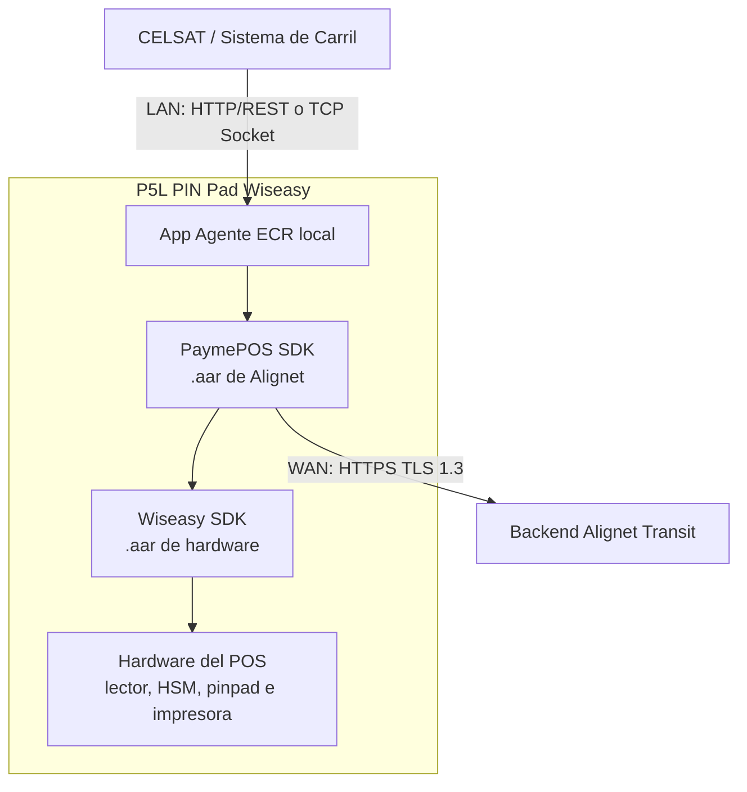
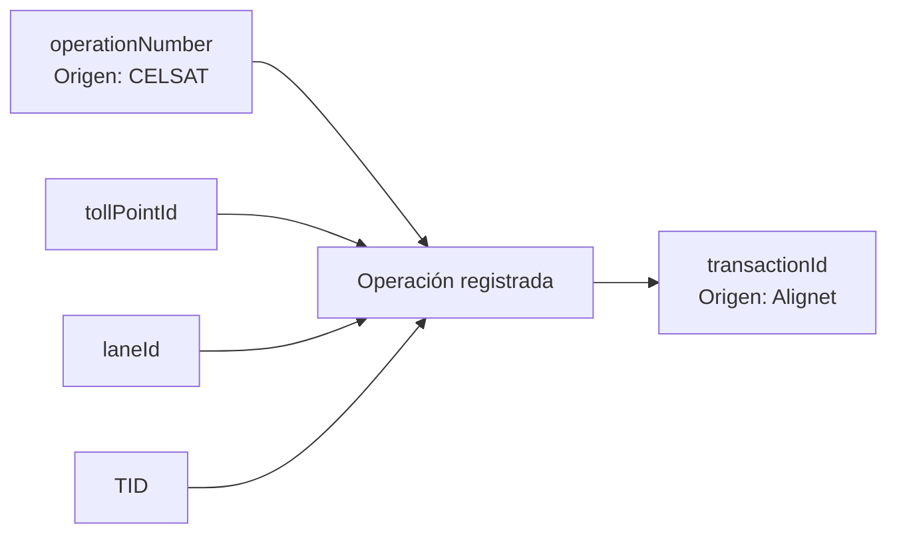

La arquitectura conecta el **Sistema de Control de Carril de CELSAT (SCC)** con una aplicación Agente ECR local instalada en el **terminal P5L PIN Pad**. El Agente ECR utiliza el **PaymePOS SDK provisto por Alignet**, que a su vez se integra con el Wiseasy SDK para operar el hardware del POS. El PaymePOS SDK presenta el monto en el terminal y se comunica con el backend Alignet Transit.

## Arquitectura por carril

| Comunicación | Propósito | Referencia técnica actual |
| --- | --- | --- |
| CELSAT / Sistema de Carril ↔ Agente ECR local | Estado, inicio, seguimiento y resultado de la operación. | Comunicación LAN mediante HTTP/REST o TCP Socket. El Agente ECR escucha en el puerto `8080` o `9090`; la opción definitiva debe confirmarse. |
| Agente ECR local ↔ PaymePOS SDK | Entrega de la operación a la capa de pagos de Alignet dentro del POS. | Integración local dentro de la aplicación del terminal. |
| PaymePOS SDK ↔ Wiseasy SDK | Acceso a las capacidades del hardware. | Librerías `.aar` de Alignet y Wiseasy, respectivamente. |
| PaymePOS SDK ↔ Backend Alignet Transit | Procesamiento y trazabilidad. | Comunicación WAN mediante HTTPS con TLS 1.3. |
| Hardware del P5L PIN Pad ↔ medio de pago | Lectura por chip EMV o EMV Contactless/NFC. | Tarjeta con chip; tarjeta, teléfono o wearable contactless. |

<Warning>
  La separación de comunicaciones no define aprobación offline ni el comportamiento ante indisponibilidad WAN. Esa política debe acordarse, documentarse y probarse.
</Warning>

## Responsabilidades

| Componente | Responsabilidad | Información que administra |
| --- | --- | --- |
| CELSAT / Sistema de Carril | Clasificación, tarifa, `operationNumber`, punto de peaje, carril, comunicación con el Agente ECR y control de barrera. | Datos operativos del peaje. |
| Agente ECR local | Escucha la comunicación LAN del sistema de carril y entrega la operación al PaymePOS SDK. | Estado y mensajes de la integración local. |
| PaymePOS SDK de Alignet | Presentación del monto, gestión del flujo de pago, comunicación con el backend Alignet Transit y entrega del resultado al Agente ECR. | Datos funcionales de la operación y respuesta correlacionada. |
| Wiseasy SDK | Conexión entre el PaymePOS SDK y el hardware del POS. | Operaciones de lector, HSM, pinpad e impresora. |
| P5L PIN Pad | Ejecución de la aplicación, presentación del monto y lectura por chip o contactless. | Datos del terminal y de la interacción con el medio de pago. |
| Backend Alignet Transit | Identificación de comercio y terminal, `transactionId`, procesamiento con redes de pago y trazabilidad. | Datos de adquirencia y procesamiento. |

## Identificadores

| Identificador | Origen | Uso | Regla funcional |
| --- | --- | --- | --- |
| `operationNumber` | CELSAT / Sistema de Carril | Número de Pedido y clave de referencia del sistema de carril. | Debe ser único globalmente dentro del código de comercio. |
| `transactionId` | Alignet | Identificador de la transacción en Alignet. | Se correlaciona con `operationNumber`. |
| `tollPointId` | CELSAT | Identifica el punto de peaje. | Debe provenir del maestro real de CELSAT. |
| `laneId` | CELSAT | Identifica el carril dentro del punto de peaje. | Debe ser estable dentro de `tollPointId`. |
| `TID` | Alignet | Identifica el terminal instalado. | Un código de comercio puede tener uno o más terminales asociados. |

## Correlación mínima

El sistema de control de carril debe conservar `operationNumber`. Cuando Alignet asigne `transactionId`, ambos identificadores deben quedar correlacionados en los registros y evidencias de prueba.

<Note>
  Un timeout o la pérdida de una respuesta no elimina esta correlación. El sistema de carril debe conservar la referencia y consultar el último estado conocido antes de reintentar.
</Note>
