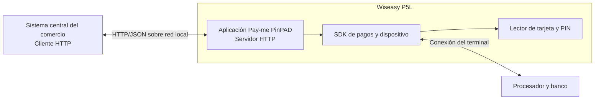

## Arquitectura



El sistema central inicia todas las llamadas hacia la IP y el puerto configurados en el Wiseasy P5L. Pay-me PinPAD muestra la pantalla de pago, captura la interacción con la tarjeta, procesa el pago y devuelve un resultado normalizado.

La comunicación de Pay-me PinPAD con el procesador o banco es transparente para el sistema central.

## Responsabilidades

| Componente | Responsabilidades |
| --- | --- |
| Sistema central del comercio — **cliente HTTP** | Calcular el monto, generar y persistir `operationNumber`, enviar solicitudes, configurar timeouts, interpretar respuestas, recuperar operaciones pendientes y aplicar la decisión de negocio. Puede ser un POS, caja, backend o SCC. |
| Pay-me PinPAD — **servidor HTTP** | Escuchar en la red local, validar el JSON, asegurar idempotencia y exclusión mutua, coordinar la interacción de pago y conservar el resultado por operación. |
| Wiseasy P5L y SDK | Leer tarjeta contactless, chip o banda, capturar PIN cuando corresponda y comunicarse con la plataforma de pagos. No requieren integración directa con el sistema central. |
| Procesador o banco | Aprobar o rechazar la transacción. No tiene una interfaz directa con el sistema central. |

## Requisitos de red

Antes de integrar, verifica lo siguiente:

- El sistema central y el Wiseasy P5L están en la misma red local y existe conectividad entre ambos.
- El punto de acceso no usa **AP Isolation** o **Client Isolation** entre el sistema central y el terminal.
- El puerto TCP configurado en Pay-me PinPAD es accesible desde el sistema central. El valor predeterminado es `8080`.
- El terminal mantiene una IP estable, preferiblemente mediante una reserva DHCP o una dirección estática.
- Las reglas de firewall permiten tráfico desde el sistema central hacia la IP y el puerto del terminal.
- La aplicación Pay-me PinPAD permanece abierta y en estado listo durante la operación.

La URL base sigue este formato:

```text
http://<IP_DEL_PINPAD>:<PUERTO>
```

Ejemplo:

```text
http://192.168.68.121:8080
```

<Warning>
  La dirección del ejemplo es ilustrativa. Confirma la IP y el puerto de cada terminal. Si cambia la IP del Wiseasy P5L, actualiza la configuración del sistema central.
</Warning>

### Verificación desde el sistema central

Primero verifica alcance IP y después la aplicación:

```bash
ping "<IP_DEL_PINPAD>"
curl "http://<IP_DEL_PINPAD>:<PUERTO>/health"
```

Una respuesta válida de la aplicación es:

```json
{ "status": "UP", "service": "Alignet ECR" }
```

Si `ping` responde pero `GET /health` no, revisa el puerto, el firewall y que Pay-me PinPAD esté abierta. Algunos entornos bloquean ICMP; en ese caso, usa `GET /health` como prueba definitiva de la aplicación.

La [configuración inicial](/procesamiento-fisico/alignet-transit/configuracion#configurar-pay-me-pinpad) se realiza una vez por terminal e incluye la IP, el puerto, la verificación de conectividad y la inyección de llaves.

## Trazabilidad

Por cada intento, registra únicamente información no sensible:

- `operationNumber`;
- `amount`, `currency` y `paymentMethod` enviados;
- código HTTP recibido;
- `status`, `resultCode` y `resultMessage`;
- `authorizationCode` y `completedAt`, cuando existan;
- fecha y hora del envío, la respuesta y las consultas;
- timeouts, pérdidas de conexión y reintentos de consulta.

El contrato vigente no devuelve `transactionID`, información de `paymentMethod`, `stateReason`, `processor` ni un historial `lifecycle`. No diseñes la integración dependiendo de esos campos.

## Seguridad y protección de datos

- Mantén la red local controlada y restringe el puerto a los sistemas autorizados mediante segmentación y reglas de firewall.
- No expongas el puerto de Pay-me PinPAD a Internet.
- No incluyas nombres, documentos, placa u otros datos personales dentro de `operationNumber`.
- No registres PAN completo, CVV, PIN, PIN Block, Track 1, Track 2 ni datos EMV sensibles.
- Protege los logs y limita su acceso según la política de retención de tu organización.
- Conserva `operationNumber` y `authorizationCode` para conciliación y comprobantes.

La versión vigente documenta HTTP dentro de la red local y no define headers de autenticación para la interfaz entre el sistema central y Pay-me PinPAD. Consulta [Autenticación y control de acceso](/procesamiento-fisico/alignet-transit/autenticacion) antes de incorporar controles adicionales.
