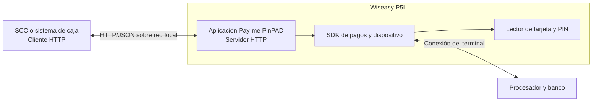

## Arquitectura



El SCC inicia todas las llamadas hacia la IP y el puerto configurados en el Wiseasy P5L. Pay-me PinPAD muestra la pantalla de pago, captura la interacción con la tarjeta, procesa el pago y devuelve un resultado normalizado.

La comunicación de Pay-me PinPAD con el procesador o banco es transparente para el SCC.

## Responsabilidades

| Componente | Responsabilidades |
| --- | --- |
| SCC o sistema de caja — **cliente HTTP** | Calcular el monto, generar y persistir `operationNumber`, enviar las solicitudes, configurar los timeouts, interpretar las respuestas, recuperar operaciones pendientes y aplicar la regla del carril. |
| Pay-me PinPAD — **servidor HTTP** | Escuchar en la red local, validar el JSON, asegurar idempotencia y exclusión mutua, coordinar la interacción de pago y conservar el resultado por operación. |
| Wiseasy P5L y SDK | Leer tarjeta contactless, chip o banda, capturar PIN cuando corresponda y comunicarse con la plataforma de pagos. No requieren integración directa con el SCC. |
| Procesador o banco | Aprobar o rechazar la transacción. No tiene una interfaz directa con el SCC. |

## Requisitos de red

Antes de integrar, verifica lo siguiente:

- El SCC y el Wiseasy P5L están en la misma red local y existe conectividad entre ambos.
- El punto de acceso no usa **AP Isolation** o **Client Isolation** entre el SCC y el terminal.
- El puerto TCP configurado en Pay-me PinPAD es accesible desde el SCC. El valor predeterminado es `8080`.
- El terminal mantiene una IP estable, preferiblemente mediante una reserva DHCP o una dirección estática.
- Las reglas de firewall permiten tráfico desde el SCC hacia la IP y el puerto del terminal.
- La aplicación Pay-me PinPAD permanece abierta y en estado listo durante la operación.

La URL base sigue este formato:

```text
http://<IP_DEL_PINPAD>:<PUERTO>
```

Ejemplo:

```text
http://192.168.68.121:8080
```

<Warning>
  La dirección del ejemplo es ilustrativa. Confirma la IP y el puerto de cada terminal. Si cambia la IP del Wiseasy P5L, actualiza la configuración del SCC.
</Warning>

### Verificación desde el SCC

Primero verifica alcance IP y después la aplicación:

```bash
ping <IP_DEL_PINPAD>
curl http://<IP_DEL_PINPAD>:<PUERTO>/health
```

Una respuesta válida de la aplicación es:

```json
{ "status": "UP", "service": "Alignet ECR" }
```

Si `ping` responde pero `GET /health` no, revisa el puerto, el firewall y que Pay-me PinPAD esté abierta. Algunos entornos bloquean ICMP; en ese caso, usa `GET /health` como prueba definitiva de la aplicación.

## Configuración inicial de Pay-me PinPAD

Al iniciar Pay-me PinPAD por primera vez, el operador verá un asistente de configuración con tres etapas: **Bienvenida**, **Conexión** y **Verificación**.

<Frame>
  
</Frame>

<Note>
  La dirección `192.168.20.50` mostrada en la imagen es solo un ejemplo. Ingresa la IP asignada al Wiseasy P5L en la red del carril. El puerto predeterminado es `8080`, pero debes confirmar el valor configurado para el terminal.
</Note>

El operador completa el asistente una vez en cada Wiseasy P5L:

<Steps>
  <Step title="Bienvenida">
    La primera pantalla presenta el proceso de configuración. Selecciona **Empezar** para continuar.
  </Step>
  <Step title="Conexión">
    Ingresa la **Dirección IP** del propio Wiseasy P5L y el **Puerto** en el que escuchará Pay-me PinPAD. El SCC utilizará ambos valores para construir la URL base `http://<IP_DEL_PINPAD>:<PUERTO>`.
  </Step>
  <Step title="Verificación">
    La pantalla final valida **Conexión disponible** e **Inyección de llaves**. Envía un `GET /health` real desde el SCC para confirmar la conexión. Pay-me PinPAD verifica las llaves de seguridad en el terminal. Cuando ambos indicadores estén en verde, selecciona **Continuar**. La aplicación quedará en **Listo para el siguiente vehículo**.
  </Step>
</Steps>

El SCC no inyecta llaves ni inicializa directamente el SDK de pagos.

## Trazabilidad

Por cada intento, registra únicamente información no sensible:

- `operationNumber`;
- `amount` y `currency` enviados;
- código HTTP recibido;
- `status`, `resultCode` y `resultMessage`;
- `authorizationCode` y `completedAt`, cuando existan;
- fecha y hora del envío, la respuesta y las consultas;
- timeouts, pérdidas de conexión y reintentos de consulta.

El contrato vigente no devuelve `transactionID`, información de `paymentMethod`, `stateReason`, `processor` ni un historial `lifecycle`. No diseñes la integración dependiendo de esos campos.

## Seguridad y protección de datos

- Mantén la red local controlada y restringe el puerto a los SCC autorizados mediante segmentación y reglas de firewall.
- No expongas el puerto de Pay-me PinPAD a Internet.
- No incluyas nombres, documentos, placa u otros datos personales dentro de `operationNumber`.
- No registres PAN completo, CVV, PIN, PIN Block, Track 1, Track 2 ni datos EMV sensibles.
- Protege los logs y limita su acceso según la política de retención de tu organización.
- Conserva `operationNumber` y `authorizationCode` para conciliación y comprobantes.

La versión vigente documenta HTTP dentro de la red local y no define headers de autenticación para la interfaz SCC–Pay-me PinPAD. Cualquier control adicional debe acordarse con Alignet antes de incorporarlo al cliente.
