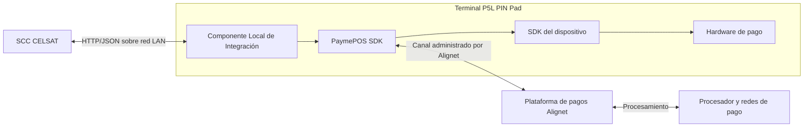
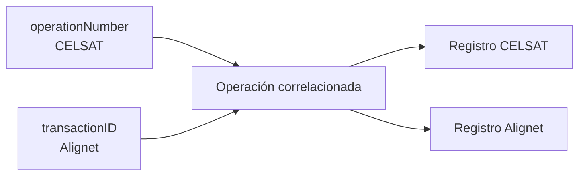

## Arquitectura por carril



La red LAN conecta el SCC con el Componente Local de Integración del P5L. Los valores de direccionamiento y habilitación del ambiente se entregan fuera del contrato funcional y están sujetos a validación final.

## Componentes y responsabilidades

| Componente | Responsabilidad | Visibilidad para CELSAT |
| --- | --- | --- |
| SCC CELSAT | Calcular el importe, generar `operationNumber`, enviar solicitudes, interpretar respuestas y aplicar la política del carril. | Componente implementado y operado por CELSAT. |
| Componente Local de Integración | Exponer los endpoints HTTP, validar la solicitud, invocar PaymePOS SDK y normalizar la respuesta. | Única interfaz técnica consumida por el SCC. |
| PaymePOS SDK | Coordinar el flujo transaccional y la interacción con la plataforma de pagos. | Encapsulado dentro del P5L. |
| SDK del dispositivo | Controlar las capacidades del P5L y la interacción con el medio de pago. | Encapsulado dentro del P5L. |
| Plataforma de pagos Alignet | Procesar la autorización, asignar `transactionID` y devolver el resultado financiero. | Accedida indirectamente mediante el Componente Local. |
| Procesador y redes de pago | Autorizar o denegar la operación de acuerdo con las reglas del medio de pago. | Sin integración directa con CELSAT. |

## Frontera de integración

CELSAT consume únicamente:

```http
POST /api/v1/payments
GET /api/v1/payments/{operationNumber}
```

Ambas operaciones usan JSON. La URL base y el mecanismo de autenticación se confirman durante la habilitación final del ambiente.

El SCC no debe depender de:

- modelos, métodos o callbacks internos de PaymePOS SDK;
- mensajes ISO 8583;
- estructuras internas del procesador;
- datos EMV o información sensible de tarjeta;
- detalles de comunicación entre el P5L y la plataforma de pagos.

## Identificadores

| Identificador | Origen | Disponibilidad | Uso |
| --- | --- | --- | --- |
| `operationNumber` | CELSAT | Se genera antes de la solicitud y se conserva durante todo el ciclo. | Idempotencia, consulta y correlación con el evento del carril. |
| `transactionID` | Alignet | Se retorna cuando existe una transacción generada en backend. | Trazabilidad, soporte, búsqueda, conciliación y flujos posteriores. |
| `IdTurnoVia` | CELSAT | Se envía dentro de `additionalFields`. | Agrupación y conciliación de las operaciones por turno o vía. |



`operationNumber` y `transactionID` son identificadores distintos. El SCC debe conservar ambos cuando `transactionID` se encuentre disponible.

## Trazabilidad mínima

Por cada operación, CELSAT debe registrar, cuando existan:

- `operationNumber` y `transactionID`;
- `amount` y `currency`;
- `additionalFields`, cuando se haya enviado;
- `success`, `resultCode` y `resultMessage`;
- `state` y `stateReason`;
- `authorizationCode` y `responseCode`;
- información no sensible de `paymentMethod`;
- fecha y hora de envío y recepción;
- eventos de timeout, consulta, reconexión y recuperación.

No registres PAN completo, CVV, PIN, PIN Block, Track 1, Track 2 ni datos EMV sensibles.
