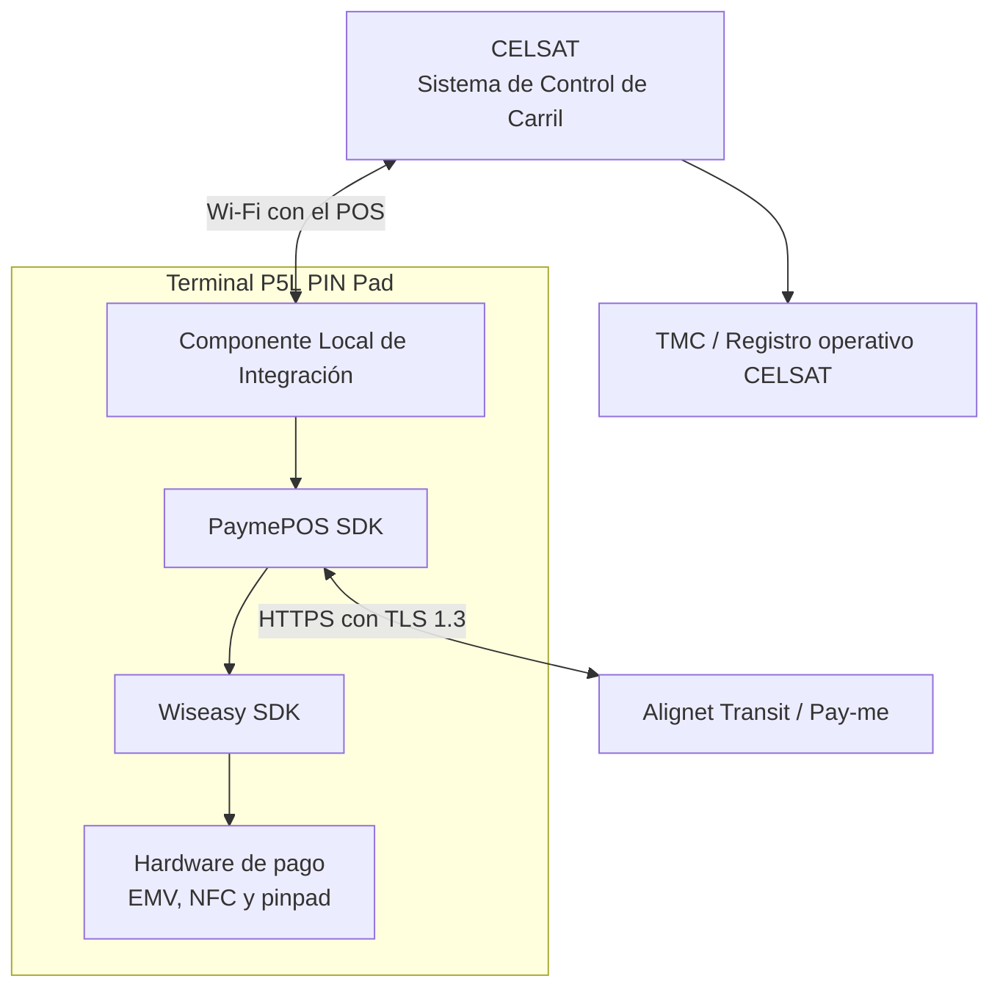
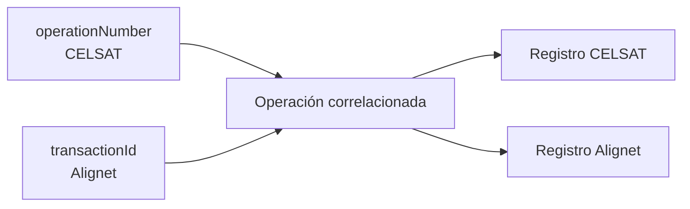

## Arquitectura por carril

## Actores y responsabilidades

| Actor o componente | Responsabilidad funcional | Información administrada |
| --- | --- | --- |
| CELSAT / SCC | Clasificar el vehículo, calcular la tarifa, asignar la referencia, solicitar el pago, interpretar el resultado y controlar la barrera. | Datos operativos del carril. |
| Componente Local de Integración | Exponer la interfaz local, validar solicitudes, coordinar el flujo de pago y devolver respuestas correlacionadas. | Estado de la interfaz y correlación local. |
| PaymePOS SDK | Gestionar el flujo de pago y la comunicación con Alignet Transit. | Datos funcionales de la operación. |
| Wiseasy SDK y P5L | Presentar el monto y operar lector EMV, NFC, pinpad y capacidades criptográficas. | Interacción con el medio de pago. |
| Alignet Transit / Pay-me | Procesar la operación, asignar `transactionId` y mantener la trazabilidad transaccional. | Datos de procesamiento y adquirencia. |
| TMC de CELSAT | Conservar el evento y las referencias necesarias para operación y conciliación. | Registro operativo de CELSAT. |

## Límites de comunicación

| Enlace | Propósito | Configuración |
| --- | --- | --- |
| SCC ↔ Componente Local | Disponibilidad, inicio, seguimiento, consulta, cancelación y resultado. | Conexión Wi-Fi con el POS habilitada por Alignet. |
| Componente Local ↔ PaymePOS SDK | Entrega de la operación a la capa de pago. | Administrado por Alignet dentro del terminal. |
| PaymePOS SDK ↔ Wiseasy SDK | Acceso al hardware del P5L. | Administrado por Alignet y Wiseasy. |
| PaymePOS SDK ↔ Alignet Transit | Procesamiento y trazabilidad. | Canal seguro administrado por Alignet. |
| SCC ↔ TMC | Registro del evento y conciliación. | Administrado por CELSAT. |

<Note>
  Si la conexión con el POS no está disponible, el SCC debe conservar la referencia y aplicar el flujo de recuperación acordado.
</Note>

## Identificadores

| Identificador | Origen | Uso | Regla |
| --- | --- | --- | --- |
| `operationNumber` | CELSAT | Referencia de la operación del carril. | Identifica una única operación lógica dentro del ámbito del comercio. Formato y longitud coordinados con CELSAT. |
| `transactionId` | Alignet | Identificador transaccional. | Se conserva separado y correlacionado con `operationNumber`. |

`transactionId` no debe copiar ni reutilizar el valor de `operationNumber`. El SCC conserva ambos identificadores cuando se encuentren disponibles.

## Trazabilidad mínima

CELSAT debe registrar:

- `operationNumber` y `transactionId`;
- monto y moneda;
- datos adicionales definidos por CELSAT, cuando los envíe;
- fecha del evento con zona horaria;
- fechas de envío y recepción;
- estado de solicitud, resultado y razón;
- eventos de timeout, reconexión y recuperación;
- versión de la interfaz y terminal asociado.

Los registros deben permitir reconstruir la secuencia sin incluir PAN completo, datos EMV sensibles ni material criptográfico.

## Consideraciones de conectividad

- La comunicación con el P5L utiliza la conexión Wi-Fi habilitada para el POS.
- Alignet gestiona la configuración necesaria para esta conexión.
- SCC y P5L deben mantener sus relojes sincronizados.
- Cada operación debe permanecer asociada al terminal que la procesó.
