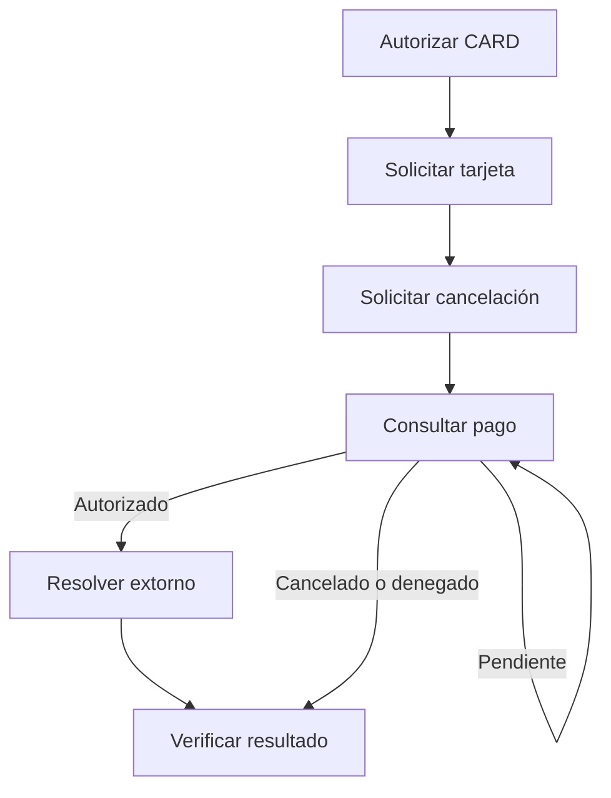
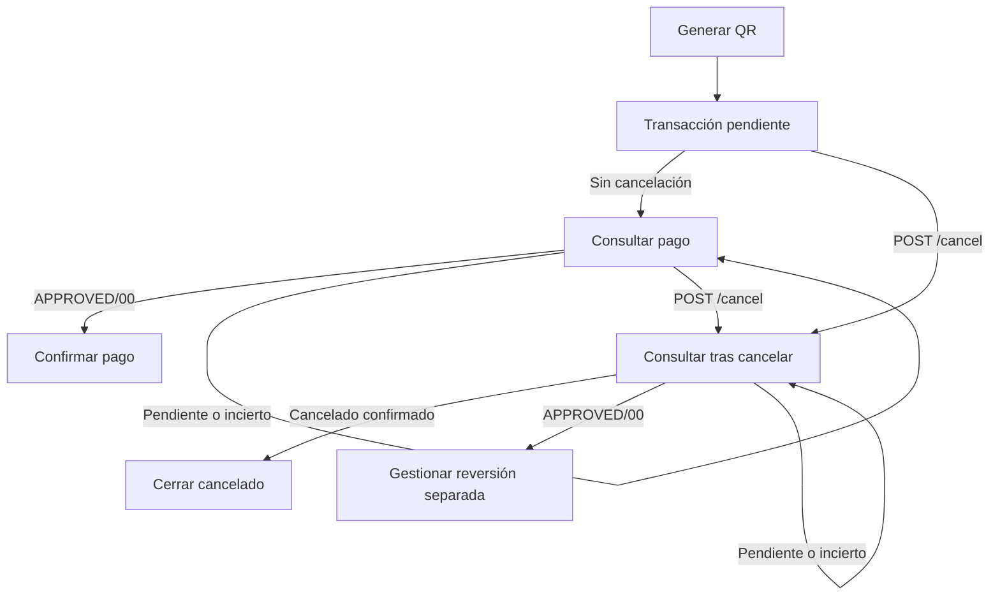

Usa `POST /cancel` para resolver una autorización en curso. Para una venta que ya conoces como aprobada, usa el [extorno explícito](/procesamiento-fisico/alignet-transit/extorno).

<Warning>
  Cuando el PinPAD recibe y procesa la solicitud de cancelación, corta el flujo visual de pago. Este cierre no confirma por sí solo el resultado financiero. Consulta siempre `GET /payments/{operationNumber}` después de solicitar cancelación, incluso con HTTP `200`.
</Warning>

## CARD

`POST /authorize` con `paymentMethod: "CARD"` inicia el flujo y el PinPAD solicita la tarjeta. La cancelación interrumpe el procesamiento si todavía no existe un cobro aprobado. Si se aprueba durante la cancelación, el flujo interno localiza la autorización y ejecuta el extorno correspondiente.



El extorno interno de CARD pertenece a `/cancel`. No apliques automáticamente los requisitos de presentación de tarjeta del extorno explícito a este flujo.

## QR

`POST /authorize` con `paymentMethod: "QR"` inicia el flujo. **Al generarse el QR, ya existe una transacción asociada al `operationNumber`, pendiente de pago.** La transacción no comienza al escanear. Generar, mostrar o escanear el QR no confirma el cobro; se requiere la confirmación del pago.

`POST /cancel` solicita cancelar la transacción QR pendiente. **No ejecuta extornos en QR ni revierte un pago aprobado.**



- Sin solicitud de cancelación, `APPROVED/00` confirma el pago y permite ejecutar la acción de negocio.
- Los ciclos repiten solo `GET /payments/{operationNumber}` según la política acordada y `Retry-After`; no reenvían `/cancel` ni generan otra venta.
- Si aparece `APPROVED/00` después de solicitar cancelación, no lo registres como cancelado ni extornado. Gestiona su reversión mediante un procedimiento separado confirmado para QR; no presupongas `/reversals`. Si no está definido, conserva la operación sin resolver y escala a Alignet.
- Cierra rechazos confirmados como no aprobados. Gestiona errores o resultados indeterminados según su causa; conserva la referencia mientras falte resolución.

## Solicitud

Envía al mismo PinPAD de la autorización original:

```http
POST /cancel
Content-Type: application/json
```

```json
{
  "operationNumber": "44992528"
}
```

| Campo | Tipo | Obligatorio | Uso |
| --- | --- | --- | --- |
| `operationNumber` | String | Sí | Referencia original de la autorización en curso. |

No generes otra referencia ni envíes monto, moneda, método o datos de tarjeta.

```bash
curl --request POST "http://<IP_DEL_PINPAD>:<PUERTO>/cancel" \
  --header "Content-Type: application/json" \
  --max-time 110 \
  --data '{"operationNumber":"44992528"}'

curl -i "http://<IP_DEL_PINPAD>:<PUERTO>/payments/44992528"
```

La consulta es obligatoria aunque el POST responda `200`. Si recibes `Retry-After`, espera el intervalo indicado antes de consultar.

## Resultados por método

Evalúa método, estado, código y mensaje conjuntamente. No clasifiques cualquier `DENIED` como cancelación.

| Método | Resultado de cancelación | Interpretación |
| --- | --- | --- |
| CARD | `DENIED`, `resultCode: "14"`, `resultMessage: "Operación cancelada"`. | Cancelación completada: se interrumpió antes del cobro o terminó el extorno interno de la autorización encontrada. Verifica por consulta. |
| QR | `CANCELLED`, `resultCode: "00"`. | Respuesta observada de cancelación; contrástala con la versión vigente. Conserva el mensaje real y verifica por consulta. No equivale a aprobación ni acredita un extorno. |

Estas respuestas exitosas corresponden únicamente a cancelaciones completadas. Los ejemplos muestran solo campos de decisión, no un esquema completo:

<CodeGroup>

```json CARD
{
  "operationNumber": "44992528",
  "status": "DENIED",
  "resultCode": "14",
  "resultMessage": "Operación cancelada"
}
```

```json QR observado
{
  "operationNumber": "44992529",
  "status": "CANCELLED",
  "resultCode": "00"
}
```

</CodeGroup>

## Verificar el resultado final

**Solicitar cancelación → cortar el flujo visual al recibir y procesar la solicitud → consultar → resolver el cobro vigente → verificar.**

1. Conserva la referencia original, el método y las respuestas recibidas.
2. Consulta `GET /payments/{operationNumber}` después de cualquier cancelación, incluso con HTTP `200`.
3. Aplica esta tabla **después de solicitar cancelación** y verifica la resolución antes de cerrar la operación.

| Resultado actualizado | Acción |
| --- | --- |
| Cancelación confirmada según el método | Cierra como cancelada. |
| CARD: `APPROVED` + `00` | Verifica si el extorno interno terminó o está en curso. Si está en curso, espera y consulta. Si el cobro sigue vigente y confirmas que no hay extorno completado ni en curso, solicita el extorno explícito y consulta su resultado. |
| QR: `APPROVED` + `00` | No lo consideres extornado por `/cancel`. Aplica un procedimiento separado confirmado para QR y verifica su resultado; no presupongas soporte de `/reversals`. Sin ese procedimiento, mantén la operación sin resolver y escala. |
| `PENDING`, `PROCESSING` o `UNKNOWN` | Continúa consultando y respeta `Retry-After`. No asumas cancelación, aprobación ni extorno. Escala al alcanzar el límite acordado. |
| Denegación confirmada | Cierra como no aprobado; distingue rechazo de cancelación mediante código y mensaje. |
| Error o respuesta contradictoria | Conserva la operación sin resolver; verifica referencia, terminal y evidencias. No registres una cancelación completada. |

<Warning>
  No generes un extorno duplicado ni una nueva transacción mientras el resultado anterior siga sin resolverse. Encontrar la autorización original no basta para saber si fue extornada: autorización y extorno pueden tener registros separados.
</Warning>

### Verificación del extorno interno CARD

`GET /payments/{operationNumber}` verifica autorización/cancelación. La evidencia disponible no define cómo consultar por separado el extorno interno de CARD ni confirma que aparezca en `/reversals`. No uses un `404` de esa ruta para concluir que no existe un extorno interno.

Si la consulta muestra una autorización vigente pero no permite comprobar el extorno interno, concilia con Alignet antes de enviar otra reversa. `GET /reversals/{operationNumber}` verifica los extornos **explícitos** solicitados mediante `POST /reversals`.

## Fallos de cancelación

| Situación | Tratamiento |
| --- | --- |
| Falla de conexión con el PinPAD | No puedes asegurar que recibió la solicitud ni que cerró la pantalla. Recupera conectividad y consulta la referencia original. |
| Solicitud recibida, con fallo interno | El cierre visual no confirma cancelación financiera. El POST debe reflejar el fallo o estado pendiente real, sin devolver una cancelación exitosa incorrecta. |
| Cancelación completada | La respuesta debe reflejar lo ejecutado: CARD puede incluir extorno interno; QR cancela solo la transacción pendiente. Consulta siempre el pago. |

La consulta posterior no justifica responder éxito ante un fallo interno. Los HTTP, códigos y cuerpos exactos de estos fallos requieren confirmación de desarrollo; el contrato de errores sigue abierto. Consulta [Datos por validar](/procesamiento-fisico/alignet-transit/datos-por-validar).

## Manejo de 202 y pérdida de conexión

| Respuesta de `/cancel` | Significado documentado | Acción |
| --- | --- | --- |
| `200` | Resultado en el cuerpo; no basta el HTTP. | Evalúa la combinación por método y consulta siempre el pago. |
| `202` con `Retry-After` | Venció la espera de referencia de 90 segundos; sin resultado final. | Respeta el header y consulta el pago. El cuerpo y los códigos específicos requieren validación. |
| `404` | La referencia no existe en ese PinPAD. | Verifica referencia y terminal; consulta la operación original. No equivale a cancelación. |
| `503` | SDK no listo o pantalla no disponible. | Recupera disponibilidad y consulta antes de reintentar. No equivale a cancelación. |
| Timeout o desconexión | No hay certeza de recepción, cierre visual ni resultado financiero. | Recupera conexión y consulta la referencia original; no repitas automáticamente el POST. |

Un `202 PENDING` tardío de `/authorize` no reemplaza un resultado final confirmado. La solicitud original puede seguir abierta después de que se cierre la pantalla. Conserva ambos eventos y decide con el estado actualizado.

Los cuerpos de fallos, la consulta del extorno interno CARD y el procedimiento separado de reversión QR requieren [confirmación por versión](/procesamiento-fisico/alignet-transit/datos-por-validar). No presentes un procesamiento fallido como cancelación completada.
