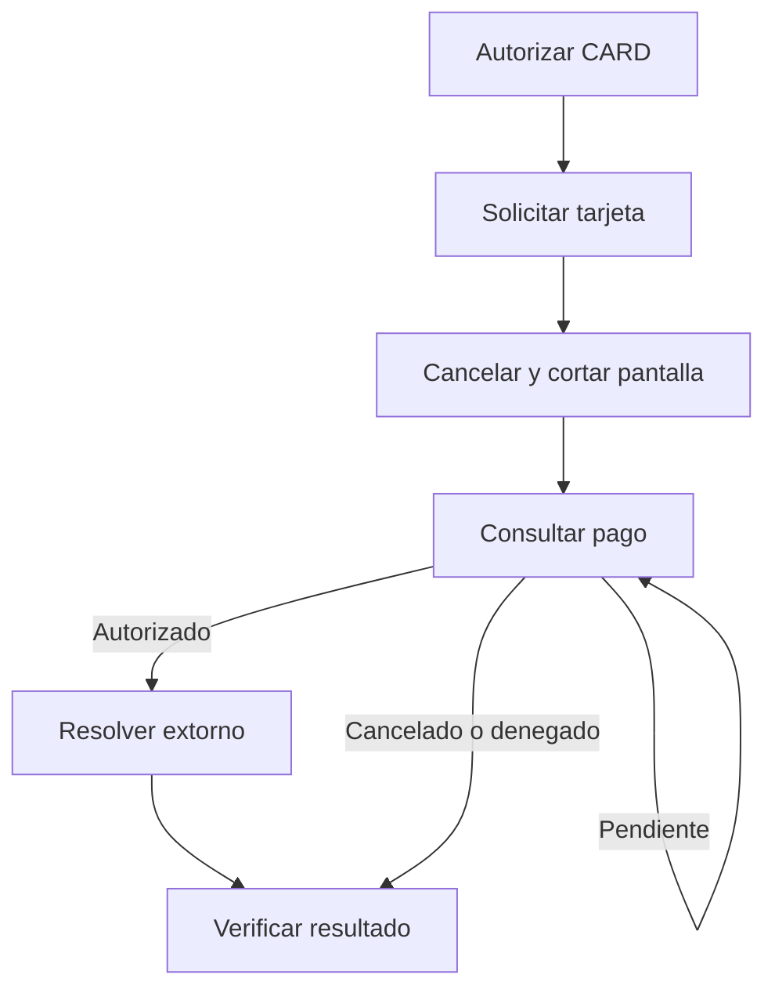
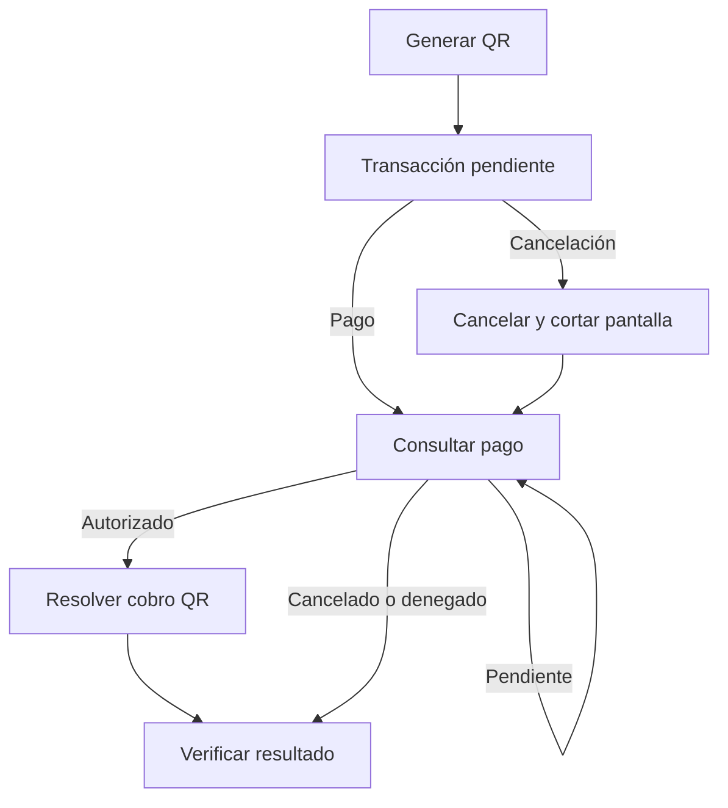

Usa `POST /cancel` para resolver una autorización en curso. Para una venta que ya conoces como aprobada, usa el [extorno explícito](/procesamiento-fisico/alignet-transit/extorno).

<Warning>
  Para CARD y QR, cualquier solicitud de cancelación corta el flujo visual de pago del PinPAD. Siempre consulta `GET /payments/{operationNumber}` después de cancelar, incluso si `/cancel` respondió HTTP `200`. Cerrar la pantalla no confirma el resultado financiero.
</Warning>

## CARD

`POST /authorize` con `paymentMethod: "CARD"` inicia el flujo y el PinPAD solicita la tarjeta. La cancelación interrumpe el procesamiento si todavía no existe un cobro aprobado. Si se aprueba durante la cancelación, el flujo interno localiza la autorización y ejecuta el extorno correspondiente.



El extorno interno pertenece a `/cancel`. No apliques automáticamente los requisitos de presentación de tarjeta del extorno explícito a este flujo.

## QR

`POST /authorize` con `paymentMethod: "QR"` inicia el flujo. **Al generarse el QR, ya existe una transacción asociada al `operationNumber`, pendiente de pago.** La transacción no comienza al escanear. Generar o mostrar el QR no confirma el cobro; se requiere la confirmación del pago.

La cancelación actúa sobre esa transacción y corta la pantalla de pago.



Si llega una confirmación de pago durante la cancelación, consulta el estado. No está verificado que QR ejecute un extorno interno ni que admita `POST /reversals`. Resuelve el cobro mediante el mecanismo habilitado y confirmado para QR; si no está definido, conserva la operación abierta y escala a Alignet. No copies la regla de extorno interno de CARD.

## Solicitud

Envía al mismo PinPAD de la autorización original:

```http
POST /cancel
Content-Type: application/json
```

```json
{
  "operationNumber": "44992528"
}
```

| Campo | Tipo | Obligatorio | Uso |
| --- | --- | --- | --- |
| `operationNumber` | String | Sí | Referencia original de la autorización en curso. |

No generes otra referencia ni envíes monto, moneda, método o datos de tarjeta.

```bash
curl --request POST "http://<IP_DEL_PINPAD>:<PUERTO>/cancel" \
  --header "Content-Type: application/json" \
  --max-time 110 \
  --data '{"operationNumber":"44992528"}'

curl -i "http://<IP_DEL_PINPAD>:<PUERTO>/payments/44992528"
```

La consulta es obligatoria aunque el POST responda `200`. Si recibes `Retry-After`, espera el intervalo indicado antes de consultar.

## Resultados por método

Evalúa método, estado, código y mensaje conjuntamente. No clasifiques cualquier `DENIED` como cancelación.

| Método | Resultado de cancelación | Interpretación |
| --- | --- | --- |
| CARD | `DENIED`, `resultCode: "14"`, `resultMessage: "Operación cancelada"`. | Cancelación completada: se interrumpió antes del cobro o terminó el extorno interno de la autorización encontrada. Verifica por consulta. |
| QR | `CANCELLED`, `resultCode: "00"`. | Respuesta observada de cancelación; contrástala con la versión vigente. Conserva el mensaje real y verifica por consulta. No equivale a aprobación ni acredita un extorno. |

Estos ejemplos muestran solo los campos de decisión, no un esquema completo:

<CodeGroup>

```json CARD
{
  "operationNumber": "44992528",
  "status": "DENIED",
  "resultCode": "14",
  "resultMessage": "Operación cancelada"
}
```

```json QR observado
{
  "operationNumber": "44992529",
  "status": "CANCELLED",
  "resultCode": "00"
}
```

</CodeGroup>

## Verificar el resultado final

**Cancelar → cortar el flujo visual → consultar el estado → resolver cualquier cobro autorizado → verificar el resultado.**

1. Conserva la referencia original, el método y las respuestas recibidas.
2. Consulta `GET /payments/{operationNumber}` después de cualquier cancelación, incluso con HTTP `200`.
3. Aplica la decisión de la tabla y verifica la resolución antes de cerrar la operación.

| Resultado actualizado | Acción |
| --- | --- |
| Cancelación confirmada según el método | Cierra como cancelada. |
| `APPROVED` + `00` | Verifica si el extorno interno terminó o está en curso. Si terminó, verifica su resultado; si está en curso, espera y consulta. Si el cobro sigue vigente y confirmas que no hay extorno completado ni en curso, solicita el extorno correspondiente al método y consulta su resultado. |
| `PENDING`, `PROCESSING` o `UNKNOWN` | Continúa consultando y respeta `Retry-After`. No asumas cancelación, aprobación ni extorno. Escala al alcanzar el límite acordado. |
| Denegación confirmada | Cierra como no aprobado; distingue rechazo de cancelación mediante código y mensaje. |
| Error o respuesta contradictoria | Conserva la operación sin resolver; verifica referencia, terminal y evidencias. No registres una cancelación completada. |

<Warning>
  No generes un extorno duplicado ni una nueva transacción mientras el resultado anterior siga sin resolverse. Encontrar la autorización original no basta para saber si fue extornada: autorización y extorno pueden tener registros separados.
</Warning>

### Verificación del extorno interno

`GET /payments/{operationNumber}` verifica autorización/cancelación. La evidencia disponible no define cómo consultar por separado el extorno interno de CARD ni confirma que aparezca en `/reversals`. No uses un `404` de esa ruta para concluir que no existe un extorno interno.

Si la consulta muestra una autorización vigente pero no permite comprobar el extorno interno, concilia con Alignet antes de enviar otra reversa. `GET /reversals/{operationNumber}` verifica los extornos **explícitos** solicitados mediante `POST /reversals`.

## Manejo de 202 y pérdida de conexión

| Respuesta de `/cancel` | Significado documentado | Acción |
| --- | --- | --- |
| `200` | Resultado en el cuerpo; no basta el HTTP. | Evalúa la combinación por método y consulta siempre el pago. |
| `202` con `Retry-After` | Venció la espera de referencia de 90 segundos; sin resultado final. | Respeta el header y consulta el pago. El cuerpo y los códigos específicos requieren validación. |
| `404` | La referencia no existe en ese PinPAD. | Verifica referencia y terminal; consulta la operación original. No equivale a cancelación. |
| `503` | SDK no listo o pantalla no disponible. | Recupera disponibilidad y consulta antes de reintentar. No equivale a cancelación. |
| Timeout o desconexión | Se perdió la respuesta. | Consulta la referencia original; el timeout no determina el resultado financiero. |

Un `202 PENDING` tardío de `/authorize` no reemplaza un resultado final confirmado. La solicitud original puede seguir abierta después de que se cierre la pantalla. Conserva ambos eventos y decide con el estado actualizado.

Los cuerpos de fallos, la consulta del extorno interno y el mecanismo de resolución QR requieren [confirmación por versión](/procesamiento-fisico/alignet-transit/datos-por-validar). No presentes un procesamiento fallido como cancelación completada.
