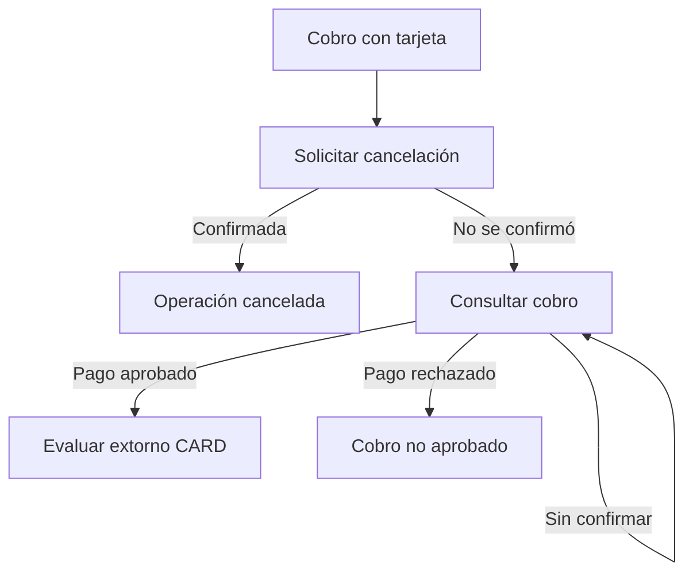
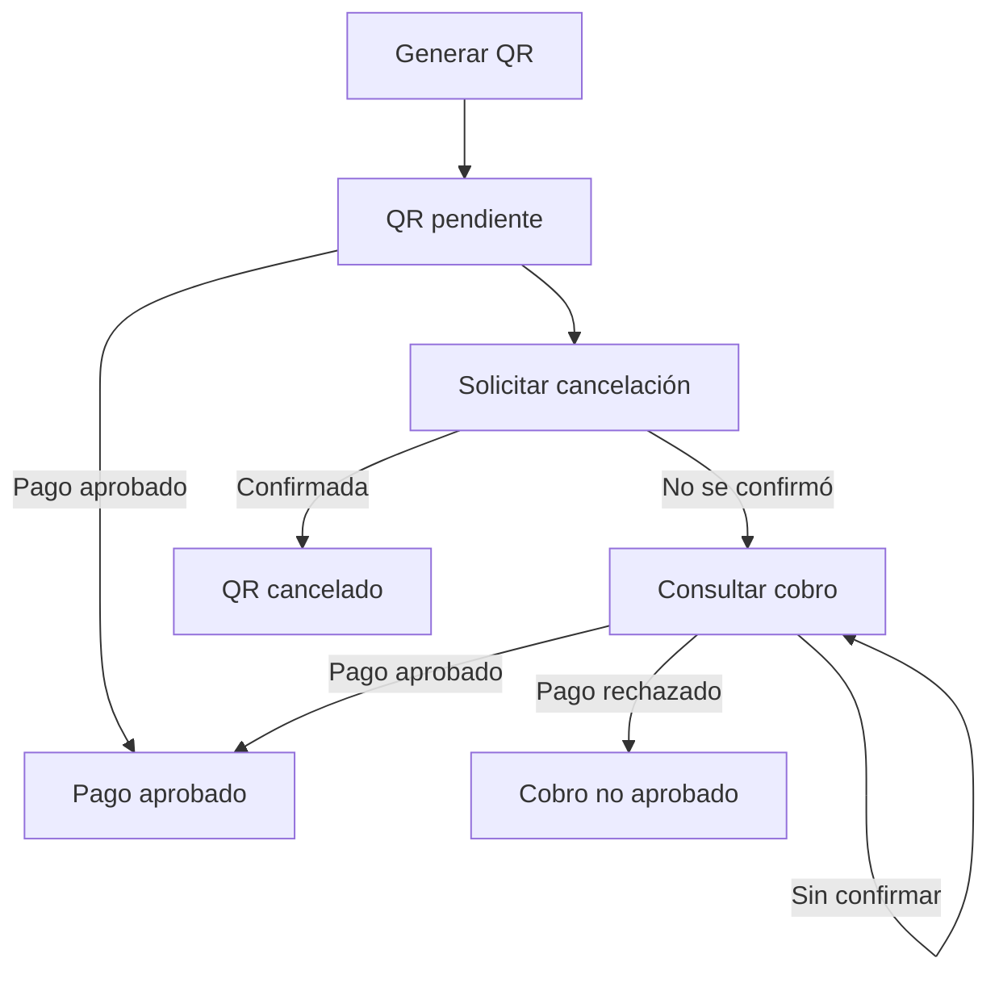

`POST /cancel` solicita cancelar una autorización activa. El servicio debe comprobar que la cancelación se ejecutó y que el resultado corresponde al `operationNumber` solicitado.

<Warning>
  Cerrar la pantalla del POS no confirma la cancelación. Si no se ejecutó o el resultado corresponde a otra operación, el servicio debe devolver un error, sin informar éxito.
</Warning>

## CARD

`POST /authorize` inicia el cobro y el PinPAD solicita la tarjeta. Si la cancelación falla y el cobro original queda `APPROVED/00`, puedes evaluar un [extorno independiente](/procesamiento-fisico/alignet-transit/extorno). Un error de `/cancel` no ejecuta automáticamente `/reversals`.



## QR

Al generar el QR ya existe una transacción pendiente asociada al `operationNumber`. Mostrar o escanear el código no confirma el pago.

En QR, `/cancel` solo cancela o inhabilita el código. Ni `/cancel` ni refund devuelven un monto pagado; `/reversals` aplica únicamente a CARD.



Si recuperas un QR `APPROVED/00`, conserva el pago aprobado. No lo marques como cancelado, devuelto ni extornado; registra la discrepancia para revisión.

## Solicitud

Envía al mismo PinPAD de la autorización original:

```http
POST /cancel
Content-Type: application/json
```

```json
{
  "operationNumber": "44992528"
}
```

| Campo | Tipo | Obligatorio | Uso |
| --- | --- | --- | --- |
| `operationNumber` | String | Sí | Referencia original de la autorización activa. |

No generes otra referencia ni envíes monto, moneda, método o datos de tarjeta.

```bash
curl -i --request POST "http://<IP_DEL_PINPAD>:<PUERTO>/cancel" \
  --header "Content-Type: application/json" \
  --max-time 110 \
  --data '{"operationNumber":"44992528"}'
```

## Resultados por método

Estas reglas aplican a CARD y QR. Evalúa el estado, el código y la validación del servicio; HTTP `200` por sí solo no confirma éxito.

| HTTP | `status` y `resultCode` | Acción |
| --- | --- | --- |
| `200` | `CANCELLED` con `00`, `16` o `17` | Cancelación confirmada o éxito equivalente, validado por el servicio. No exige otra consulta para reconocerla. |
| `200` | `DENIED` con `14`, `15`, `18`, `19`, `20`, `01`, `03` u otro código SDK | Cancelación rechazada o abandonada. Consulta el cobro original; no marques cancelación exitosa. |
| `202` | `PENDING` con `P22` o `WAITING_RESULT` | Resultado todavía no confirmado. Consulta el cobro original; este GET no informa el desenlace de `/cancel`. |
| `404` | `ERROR/NOT_FOUND` | Venta inexistente o resultado SDK `05/07`. Verifica referencia y terminal. |
| `409` | `ERROR/CANCELLATION_IN_PROGRESS` | Ya hay una cancelación de esa referencia en curso. No envíes otra. |
| `503` | `ERROR/POS_NOT_AVAILABLE` | Restablece SDK o pantalla disponible; consulta el cobro antes de decidir otro envío. |
| `400` | `ERROR/BAD_REQUEST` | Corrige el JSON. |

Ejemplos de campos de decisión, sin representar pruebas ejecutadas:

<CodeGroup>

```json Cancelación rechazada con 14
{
  "operationNumber": "44992528",
  "status": "DENIED",
  "resultCode": "14"
}
```

```json Cancelación confirmada con 16
{
  "operationNumber": "44992528",
  "status": "CANCELLED",
  "resultCode": "16"
}
```

</CodeGroup>

`DENIED/14` no confirma cancelación. Decide con estado y código. No normalices `16` o `17` a `00`.

## Verificar el resultado final

No existe un endpoint de consulta de cancelación. La respuesta de `POST /cancel` informa el resultado de esa solicitud. Ante fallo, timeout o incertidumbre, `GET /payments/{operationNumber}` permite conocer **el estado del cobro original**:

| Estado del cobro | Acción |
| --- | --- |
| CARD: `APPROVED/00` | Tras una cancelación fallida, evalúa `POST /reversals` con la referencia original, sin duplicar extornos. |
| QR: `APPROVED/00` | Conserva el pago aprobado, sin refund ni reversa. |
| `DENIED` | Cierra el cobro como no aprobado; no lo confundas con una cancelación validada. |
| `CANCELLED` | El cobro original está registrado como cancelado; no es una consulta del desenlace de `/cancel`. |
| `PROCESSING`, `PENDING` o `UNKNOWN` | Todavía no sabes si se cobró. Sigue consultando y no inicies otro cobro. |
| Error de consulta | Conserva la referencia y resuelve la causa; no deduzcas el estado financiero. |

En los ciclos del gráfico, repite únicamente el GET. No reenvíes `/cancel` ni generes otra venta mientras no conozcas el resultado del cobro. Un `202 PENDING` tardío de `/authorize` no sustituye un resultado confirmado.

## Fallos de cancelación

| Situación | Tratamiento |
| --- | --- |
| Cancelación no ejecutada o resultado de otra operación | El servicio devuelve un error; no puede informar cancelación exitosa. |
| Timeout, desconexión o fallo del backend | Muestra **Cancelación no confirmada** y recupera el cobro original. Si falta conexión, restablécela primero. |
| Cancelación ejecutada y resultado validado | Reconoce la respuesta de éxito de `/cancel`. El cierre visual por sí solo no acredita este resultado. |

La matriz no especifica la respuesta cuando la cancelación no se ejecuta o el resultado corresponde a otra operación. No asignes a ese caso un HTTP, código ni cuerpo JSON sin confirmación de desarrollo.

## Manejo de 202 y pérdida de conexión

Todas las respuestas incluyen `Cache-Control: no-store`. HTTP `202` añade `Retry-After: 2`: espera dos segundos antes de consultar el cobro original. Una desconexión no garantiza recepción de `/cancel` ni cierre de pantalla.
