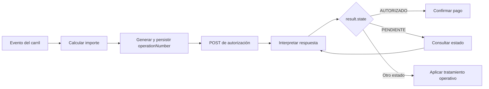

El SCC se comunica por red LAN con el **Componente Local de Integración** instalado en el P5L. Esta es la única interfaz que CELSAT debe implementar.

## Operaciones disponibles

| Operación | Método y ruta | Uso |
| --- | --- | --- |
| Autorizar pago | `POST /api/v1/payments` | Iniciar una autorización con la referencia y el importe calculados por el SCC. |
| Consultar estado | `GET /api/v1/payments/{operationNumber}` | Recuperar el resultado de una operación existente. |

No se han definido otros endpoints para el SCC en la especificación de autorización. La incorporación de operaciones adicionales requiere confirmación y documentación versionada.

## Responsabilidad del cliente SCC

El cliente debe:

- generar y persistir un `operationNumber` único por venta;
- construir el JSON con `operationNumber`, `amount` y `currency`;
- enviar los headers `Content-Type` y `Accept` con valor `application/json`;
- tolerar que `result` sea `null`;
- evaluar `result.state` antes de resolver el pago;
- almacenar `transactionID` cuando exista;
- consultar después de timeout o pérdida de comunicación;
- ignorar campos adicionales compatibles que pueda recibir en futuras revisiones del contrato;
- registrar evidencia sin datos sensibles de tarjeta.

## Flujo de autorización

<Steps>
  <Step title="Calcular el importe">
    El SCC determina el total que debe cobrarse y lo convierte a unidades menores.
  </Step>
  <Step title="Crear la referencia">
    Genera un `operationNumber` único y lo almacena antes del envío.
  </Step>
  <Step title="Enviar la solicitud">
    Ejecuta `POST /api/v1/payments` con los tres campos requeridos.
  </Step>
  <Step title="Procesar la respuesta">
    Lee `success`, `resultCode`, `resultMessage` y `result` sin asumir que `success` representa aprobación.
  </Step>
  <Step title="Resolver el estado financiero">
    Confirma el pago solo cuando `result.state` sea `AUTORIZADO`.
  </Step>
  <Step title="Recuperar si es necesario">
    Si no recibió respuesta o el estado es `PENDIENTE`, consulta con el mismo `operationNumber`.
  </Step>
</Steps>

## Manejo de condiciones especiales

<AccordionGroup>
  <Accordion title="Respuesta con result = null" icon="circle-info">
    Evalúa `resultCode`. La operación pudo haberse detenido localmente o no haber generado una transacción en backend.
  </Accordion>
  <Accordion title="Pago denegado" icon="circle-xmark">
    `success` puede ser `true`. El rechazo se determina mediante `result.state = "DENEGADO"`.
  </Accordion>
  <Accordion title="Estado pendiente" icon="clock">
    Conserva la operación abierta y ejecuta la consulta de estado con la frecuencia configurada.
  </Accordion>
  <Accordion title="Timeout o respuesta ausente" icon="link-slash">
    No generes otra venta. Restablece la comunicación y consulta el `operationNumber` original.
  </Accordion>
  <Accordion title="Dispositivo no inicializado" icon="terminal">
    El código `P04` requiere detener la operación y solicitar la inicialización del dispositivo. El SCC no inicializa directamente PaymePOS SDK.
  </Accordion>
  <Accordion title="Código desconocido" icon="circle-question">
    Conserva el código y el mensaje originales, evita inferir su significado y escala el caso.
  </Accordion>
</AccordionGroup>

## Parámetros del ambiente

Los siguientes valores se confirman durante la habilitación final:

- URL base del Componente Local;
- mecanismo de autenticación;
- timeouts de conexión y lectura;
- frecuencia y límite de consultas;
- asociación entre el SCC y el P5L del carril.

Estos parámetros no modifican los endpoints, el payload ni la lógica principal descritos en esta documentación.

## Referencias de implementación

<CardGroup cols={2}>
  <Card title="Solicitud de autorización" icon="file-export" href="/procesamiento-fisico/alignet-transit/parametros-de-envio">
    Revisa los campos y reglas del `POST`.
  </Card>
  <Card title="Respuesta, estados y códigos" icon="code" href="/procesamiento-fisico/alignet-transit/respuesta-estados-y-codigos">
    Implementa la interpretación de la respuesta normalizada.
  </Card>
</CardGroup>
