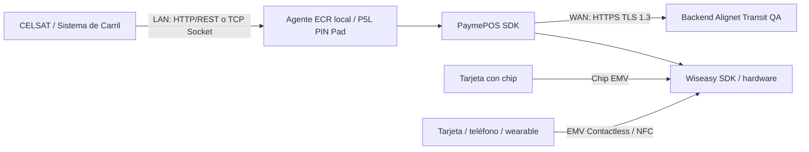

Alignet proporcionará un ambiente no productivo para desarrollar y validar la integración con el **terminal P5L PIN Pad** antes del pase a producción. Para esta etapa se entregarán tres equipos. Los accesos sensibles se proporcionarán fuera de esta documentación mediante un canal seguro.

Las pruebas conectarán el **Sistema de Control de Carril de CELSAT (SCC)** con el Agente ECR local instalado en cada P5L PIN Pad preparado para QA/UAT. El agente utilizará el PaymePOS SDK de Alignet y el Wiseasy SDK instalados dentro del POS.

## Paquete de acceso

| Elemento | Contenido | Entrega |
| --- | --- | --- |
| Endpoint / host QA | Dirección del ambiente de integración. | Durante el onboarding; valor pendiente. |
| Autenticación | Mecanismo de conexión servicio a servicio. | En la referencia técnica. |
| Credenciales | `client_id` y `client_secret` de CELSAT. | Mediante canal seguro. |
| `merchant_code` (MID / idComercio) QA | Identificador del comercio de prueba asociado al proyecto. Los tres nombres corresponden al mismo valor. | Parametrización QA. |
| `TID` QA | Terminal de prueba asociado al P5L PIN Pad. | Parametrización QA. |
| POS físicos | Tres P5L PIN Pad preparados para QA. | Entrega física coordinada. |
| Datos de prueba | Puntos, carriles y categorías habilitados en QA. | Coordinación conjunta. |
| Canal de soporte | Punto de contacto para incidencias. | Al inicio de UAT. |

<Warning>
  No almacenes credenciales reales ni material criptográfico en el repositorio. QA/UAT y producción deben permanecer segregados.
</Warning>

## Preparación de los P5L PIN Pad

Antes de entregar cada uno de los tres equipos de prueba, Alignet verificará:

- número de serie registrado;
- versión QA de la aplicación instalada;
- `TID` de pruebas asociado;
- `merchant_code` (MID / idComercio) de QA configurado;
- material criptográfico de pruebas segregado de producción;
- conectividad LAN y salida al ambiente QA;
- lectura por chip EMV y EMV Contactless/NFC disponibles;
- instrucciones básicas de encendido, conexión, reinicio y validación de estado.

## Conectividad de laboratorio

La topología debe reproducir el principio del carril productivo: el sistema de carril se comunica con el Agente ECR local, el agente invoca el PaymePOS SDK, el SDK utiliza el Wiseasy SDK para operar el hardware y se comunica con el backend Alignet Transit QA mediante HTTPS con TLS 1.3.

## Casos mínimos

| Caso | Objetivo | Resultado esperado | Evidencia |
| --- | --- | --- | --- |
| Operación con chip exitosa | Validar el flujo end-to-end mediante chip EMV. | `PASS`. | `operationNumber` + `transactionId`. |
| Operación contactless exitosa | Validar el flujo end-to-end mediante EMV Contactless/NFC. | `PASS`. | `operationNumber` + `transactionId`. |
| Operación no aceptada | Validar la decisión negativa. | `NO_PASS` + `reasonCode`. | Log o respuesta. |
| Número de Pedido duplicado | Validar idempotencia. | Misma operación, sin doble cobro. | Consulta de referencias. |
| Mismo Número de Pedido con payload distinto | Proteger contra inconsistencia. | Conflicto o rechazo. | Respuesta de validación. |
| Pérdida de comunicación local | Validar recuperación. | Consulta posterior, sin duplicidad. | Referencia y respuesta recuperada. |
| Cancelación antes de presentar el medio de pago | Validar el cierre de la solicitud. | Cancelación cuando proceda. | Resultado de cancelación. |
| P5L PIN Pad fuera de servicio | Validar la detección preventiva. | No iniciar el pago. | Estado del terminal. |
| Timeout o resultado incierto | Recuperar sin inferir rechazo. | Estado recuperado, sin doble cobro. | Referencia y consulta posterior. |
| Múltiples carriles | Validar concurrencia. | Operaciones independientes. | Registros por carril. |
| Comprobante y trazabilidad | Validar datos disponibles. | Información consistente. | Ticket o log de prueba. |

## Criterios de salida de UAT

<Check>
  Los casos obligatorios acordados se ejecutaron satisfactoriamente.
</Check>

<Check>
  CELSAT y Alignet pueden correlacionar `operationNumber` y `transactionId`.
</Check>

<Check>
  Los reintentos y las reconexiones no generan operaciones duplicadas.
</Check>

<Check>
  Ambas partes acordaron y probaron los escenarios de indisponibilidad local y recuperación.
</Check>

<Check>
  Cada terminal de prueba está asociado correctamente con su punto de peaje, carril y `TID`.
</Check>

<Check>
  Los equipos técnicos de ambas partes revisaron las evidencias.
</Check>
