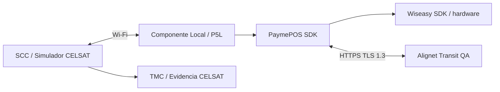

Las pruebas conectan el SCC de CELSAT con el Componente Local del P5L y Alignet Transit en un ambiente segregado de producción. Cada escenario debe generar evidencia correlacionada en ambos lados.

## Responsabilidades de preparación

| CELSAT | Alignet | Compartido |
| --- | --- | --- |
| SCC o simulador, datos de prueba, lógica de barrera, TMC, comprobante y evidencia del carril. | Ambiente Transit, terminales P5L, conexión Wi-Fi y evidencia de procesamiento. | Ejecución, análisis de resultados y aceptación. |

## Paquete de configuración

| Elemento | Contenido |
| --- | --- |
| Especificación de interfaz | Versión del contrato, transporte, mensajes, estados y errores. |
| Habilitación del POS | Terminal participante y conexión Wi-Fi gestionada por Alignet. |
| Parametrización | P5L y datos adicionales que CELSAT decida utilizar. |
| Datos de prueba | Referencias controladas, montos y escenarios. |
| Soporte | Contactos, horario, severidades y canal de incidencias. |

## Preparación del laboratorio

Antes de ejecutar las pruebas, verifica:

- SCC o simulador de CELSAT disponible;
- P5L habilitado para el ambiente de pruebas;
- conexión Wi-Fi con el POS habilitada por Alignet;
- software correspondiente al ambiente;
- datos de prueba cargados;
- relojes sincronizados;
- logs correlacionados habilitados.

## Escenarios mínimos

| Escenario | Resultado a validar | Evidencia mínima |
| --- | --- | --- |
| Pago exitoso con chip EMV | `PASS`. | `operationNumber` y `transactionId`. |
| Pago exitoso contactless | `PASS`. | Correlación completa. |
| Pago exitoso con QR interoperable | `PASS`. | Correlación completa y evidencia del flujo QR. |
| Operación no aceptada | `NO_PASS` y razón cuando corresponda. | Respuesta y logs. |
| Referencia duplicada con mismos datos | Misma operación, sin doble efecto. | Consulta de la referencia. |
| Referencia duplicada con datos distintos | Conflicto o rechazo. | Respuesta de validación. |
| Pérdida del enlace local | Recuperación sin duplicidad. | Consulta posterior. |
| Cancelación en estado permitido | Cancelación confirmada. | Estado correlacionado. |
| Terminal no disponible | Pago no iniciado. | Consulta de disponibilidad. |
| Timeout o resultado incierto | Recuperación sin inferir rechazo. | Referencia y consulta. |
| Múltiples carriles | Operaciones independientes. | Registros por carril. |
| Comprobante | Datos consistentes y permitidos. | Ticket y respuesta. |
| Reinicio del SCC o P5L | Operaciones abiertas recuperadas. | Logs antes y después del reinicio. |
| Código desconocido | Tratamiento seguro y escalamiento. | Código original y registro del SCC. |

## Criterios de aceptación

<Check>
  CELSAT y Alignet correlacionan cada operación mediante `operationNumber` y `transactionId`.
</Check>

<Check>
  Reintentos, reconexiones y reinicios no generan duplicidad financiera.
</Check>

<Check>
  El SCC recupera timeouts y resultados inciertos sin inferir `NO_PASS`.
</Check>

<Check>
  La lógica de barrera responde únicamente a una decisión operativa válida.
</Check>

<Check>
  Cada operación queda asociada al terminal que la procesó.
</Check>

<Check>
  La evidencia permite reconstruir cada escenario sin exponer información sensible.
</Check>

<Check>
  Ambas partes revisan los resultados y registran la conformidad de las pruebas.
</Check>

## Evidencia por caso

Registra:

- identificador del caso;
- fecha y hora con zona;
- ambiente y versión de interfaz;
- SCC, carril y terminal utilizados;
- `operationNumber` y `transactionId`;
- solicitud y respuesta sanitizadas;
- estado y decisión operativa;
- tiempos observados;
- logs correlacionados;
- resultado esperado y obtenido;
- observaciones y conformidad.
