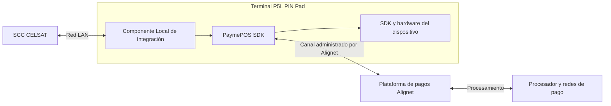

Alignet Transit permite que el **Sistema de Control de Carril de CELSAT (SCC)** inicie una autorización de pago en un **terminal P5L PIN Pad** y reciba una respuesta normalizada para resolver la operación del carril.

Esta documentación está dirigida a los equipos de arquitectura, desarrollo, QA y operación técnica de CELSAT. El SCC solo se integra con el Componente Local de Integración instalado en el P5L. Las estructuras internas de PaymePOS SDK, el SDK del dispositivo, el procesamiento adquirente y los datos sensibles de tarjeta permanecen encapsulados por Alignet.

## Alcance de la integración

La integración contempla:

- autorización de pagos iniciada por el SCC;
- solicitud HTTP `POST /api/v1/payments` en formato JSON;
- respuesta normalizada con código general y estado financiero;
- consulta HTTP `GET /api/v1/payments/{operationNumber}` para recuperar el estado;
- correlación mediante `operationNumber` y `transactionID`;
- idempotencia y prevención de cobros duplicados;
- tratamiento de errores locales, respuestas del procesador y cancelaciones del usuario;
- recuperación después de timeout, pérdida de comunicación o reinicio del SCC;
- registro de información no sensible para trazabilidad, soporte y comprobante.

## Arquitectura de la solución

El Componente Local de Integración constituye la única frontera técnica consumida por CELSAT. El SCC no invoca directamente PaymePOS SDK, el SDK del dispositivo ni la plataforma de pagos.

## Flujo principal

<Steps>
  <Step title="Preparar la operación">
    El SCC calcula el importe, genera un `operationNumber` único y lo persiste antes de enviar la solicitud.
  </Step>
  <Step title="Solicitar la autorización">
    El SCC envía `operationNumber`, `amount` y `currency` al endpoint local de autorización.
  </Step>
  <Step title="Procesar el pago">
    El Componente Local coordina PaymePOS SDK y el SDK del dispositivo. Alignet procesa la transacción en la plataforma de pagos.
  </Step>
  <Step title="Interpretar la respuesta">
    El SCC evalúa `result`, `resultCode` y, principalmente, `result.state`. El campo `success` no determina por sí solo la aprobación.
  </Step>
  <Step title="Recuperar una operación incierta">
    Ante timeout o pérdida de comunicación, el SCC conserva `operationNumber` y consulta la operación original antes de intentar otro cobro.
  </Step>
  <Step title="Cerrar el evento del carril">
    CELSAT registra la respuesta, aplica su política operativa y genera el comprobante cuando corresponda.
  </Step>
</Steps>

## Principios de implementación

- Una venta mantiene un único `operationNumber`.
- `amount` se envía como una cadena numérica que representa un entero en unidades menores.
- La aprobación se determina con `result.state = "AUTORIZADO"`.
- `success = true` solo indica que el flujo produjo una respuesta procesable.
- Un timeout no equivale a pago rechazado.
- El SCC consulta antes de generar una nueva operación después de un resultado incierto.
- CELSAT no recibe ni almacena PAN completo, CVV, PIN, PIN Block, tracks ni datos EMV sensibles.

## Cómo usar esta documentación

<CardGroup cols={2}>
  <Card title="Arquitectura y trazabilidad" icon="diagram-project" href="/procesamiento-fisico/alignet-transit/arquitectura-y-trazabilidad">
    Componentes, límites de responsabilidad e identificadores.
  </Card>
  <Card title="Solicitud de autorización" icon="file-export" href="/procesamiento-fisico/alignet-transit/parametros-de-envio">
    Endpoint, headers, campos de entrada y reglas de validación.
  </Card>
  <Card title="Respuesta, estados y códigos" icon="code" href="/procesamiento-fisico/alignet-transit/respuesta-estados-y-codigos">
    Contrato de respuesta, interpretación financiera y catálogo de resultados.
  </Card>
  <Card title="Operación y recuperación" icon="rotate" href="/procesamiento-fisico/alignet-transit/operacion-y-recuperacion">
    Secuencia, idempotencia, timeout, consulta y reconexión.
  </Card>
  <Card title="Integración del SCC con el P5L" icon="ethernet" href="/procesamiento-fisico/alignet-transit/integradores/celsat/interfaz-scc-p5l">
    Comportamiento que debe implementar el cliente de CELSAT.
  </Card>
  <Card title="Responsabilidades y preparación" icon="people-arrows" href="/procesamiento-fisico/alignet-transit/integradores/celsat/responsabilidades-y-preparacion">
    Responsabilidades de CELSAT y Alignet para iniciar la integración.
  </Card>
</CardGroup>
