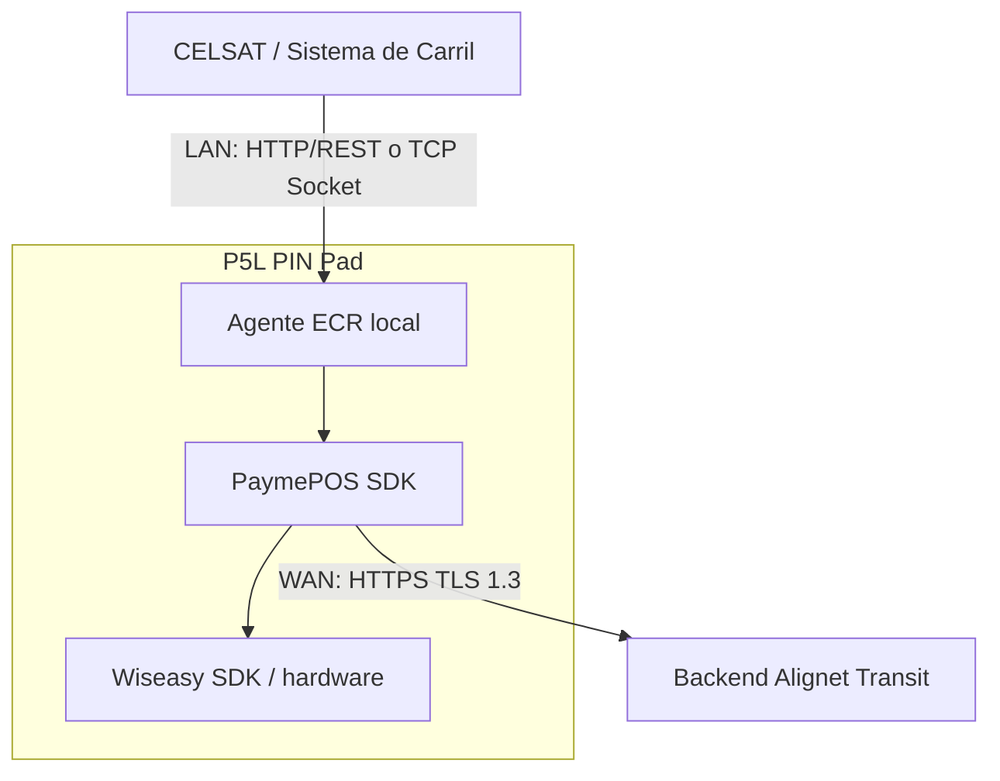

Alignet Transit permite integrar el **Sistema de Control de Carril de CELSAT (SCC)** con un **terminal P5L PIN Pad** para procesar pagos con **chip EMV** y **EMV Contactless/NFC** en peajes.

Esta documentación presenta el alcance funcional acordado para la integración con CELSAT. Los detalles aplicables a cada etapa se incorporarán progresivamente en la referencia técnica antes del desarrollo, la integración y las pruebas UAT.

<Warning>
  La arquitectura de referencia define las capas y las alternativas de comunicación, pero todavía no selecciona el protocolo y puerto local definitivos ni define schemas, endpoints, timeouts, autenticación o códigos de error. Consulta [Definiciones pendientes](/procesamiento-fisico/alignet-transit/integradores/celsat/definiciones-pendientes) antes de implementar.
</Warning>

## Propósito

La integración busca reducir el tiempo de permanencia del vehículo en el carril. El sistema de control de carril calcula la tarifa y genera la referencia de la operación. La solicitud llega por LAN al Agente ECR local instalado en el P5L PIN Pad. El Agente ECR utiliza el PaymePOS SDK de Alignet, que presenta el monto mediante el Wiseasy SDK y se comunica con el backend Alignet Transit.

## Modelo operativo

<Steps>
  <Step title="Determinar la tarifa">
    El sistema de control de carril detecta el vehículo, determina su categoría y calcula el monto.
  </Step>
  <Step title="Crear la referencia">
    El sistema de carril genera `operationNumber` y envía la solicitud al Agente ECR local del P5L PIN Pad.
  </Step>
  <Step title="Presentar el monto">
    El Agente ECR entrega la operación al PaymePOS SDK. El SDK muestra el monto mediante el Wiseasy SDK y solicita insertar una tarjeta con chip o acercar una tarjeta o un teléfono mediante EMV Contactless/NFC.
  </Step>
  <Step title="Obtener la decisión operativa">
    El PaymePOS SDK se comunica con el backend Alignet Transit mediante HTTPS con TLS 1.3 para procesar la operación y determinar `PASS` o `NO_PASS`.
  </Step>
  <Step title="Controlar el carril">
    El sistema de carril usa `PASS` o `NO_PASS` para aplicar la política de barrera acordada.
  </Step>
  <Step title="Conservar la trazabilidad">
    Alignet mantiene la correlación y continúa el lifecycle financiero aplicable.
  </Step>
</Steps>

<Info>
  `PASS` y `NO_PASS` son decisiones operativas para el carril. `PASS` no equivale directamente a todos los estados financieros internos de Alignet.
</Info>

## Alcance de esta guía

<CardGroup cols={2}>
  <Card title="Arquitectura y responsabilidades" icon="diagram-project" href="/procesamiento-fisico/alignet-transit/arquitectura-y-trazabilidad">
    Componentes, comunicaciones, responsables e identificadores compartidos.
  </Card>
  <Card title="Contrato funcional" icon="file-contract" href="/procesamiento-fisico/alignet-transit/contrato-funcional">
    Datos mínimos de entrada y resultado operativo esperado.
  </Card>
  <Card title="Operación y recuperación" icon="rotate" href="/procesamiento-fisico/alignet-transit/operacion-y-recuperacion">
    Flujo nominal, idempotencia, consulta, cancelación y estados inciertos.
  </Card>
  <Card title="Integración CELSAT" icon="road-barrier" href="/procesamiento-fisico/alignet-transit/integradores/celsat/interfaz-scc-p5l">
    Requisitos funcionales del sistema de control de carril, preparación de pruebas e información requerida.
  </Card>
</CardGroup>

## Límites del alcance

- La moneda admitida en el alcance actual es PEN, representada por el valor entero `604`.
- El alcance contempla lectura por chip EMV y EMV Contactless/NFC. La referencia técnica definirá cualquier diferencia operativa entre ambos modos.
- CELSAT genera el comprobante con los datos de trazabilidad que Alignet pueda devolver.
- La guía no expone reglas internas de Visa o Mastercard.
- La separación entre la red local y la conectividad externa no implica aprobación offline.
- La política ante indisponibilidad WAN debe acordarse y validarse antes de UAT.
