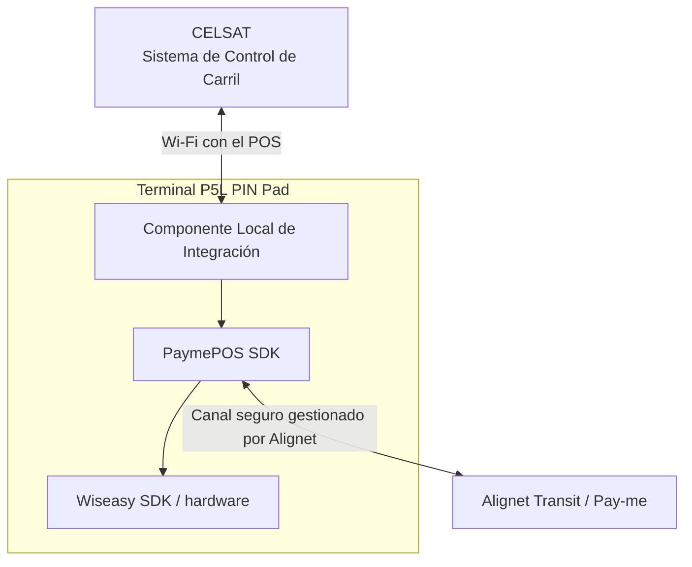

Alignet Transit permite que el **Sistema de Control de Carril de CELSAT (SCC)** solicite pagos mediante un **terminal P5L PIN Pad** y reciba una decisión operativa correlacionada para gestionar el carril.

Esta documentación está dirigida a los equipos de arquitectura, desarrollo, infraestructura, seguridad, QA y operación técnica de CELSAT. Describe qué debe preparar CELSAT, qué administra Alignet y qué parámetros se coordinan durante la habilitación de cada ambiente.

## Alcance funcional

La integración contempla:

- pagos en soles peruanos, con código numérico de moneda `604`;
- pagos mediante chip EMV, EMV Contactless/NFC y QR interoperable;
- consulta de disponibilidad del terminal;
- inicio, aceptación, seguimiento y resultado de la solicitud;
- decisión operativa `PASS` o `NO_PASS`;
- idempotencia y detección de solicitudes inconsistentes;
- consulta, cancelación y recuperación de operaciones;
- manejo de timeouts y pérdida de comunicación;
- correlación entre la referencia de CELSAT y la transacción de Alignet;
- comprobante generado por CELSAT con los datos habilitados;
- pruebas conjuntas en un ambiente segregado de producción.

<Info>
  La integración no asume autorización offline. Alignet gestiona la conectividad Wi-Fi necesaria para que el POS procese la operación.
</Info>

## Modelo de integración

CELSAT se integra con una única frontera funcional: el **Componente Local de Integración** disponible en el P5L. Este componente también puede denominarse Agente ECR o Servicio Local de Integración en los documentos de coordinación.

CELSAT no necesita invocar directamente PaymePOS SDK, Wiseasy SDK ni los servicios internos de Alignet Transit.

## Flujo general

<Steps>
  <Step title="Consultar el terminal">
    El SCC verifica que el P5L pueda recibir una operación.
  </Step>
  <Step title="Preparar la operación">
    CELSAT determina la categoría, calcula la tarifa y asigna una referencia única a la operación lógica.
  </Step>
  <Step title="Solicitar el pago">
    El SCC envía `operationNumber`, `amount`, `currency` y, cuando corresponda, `additionalFields` mediante la interfaz acordada.
  </Step>
  <Step title="Procesar la transacción">
    El Componente Local coordina PaymePOS SDK y Wiseasy SDK. PaymePOS se comunica con Alignet Transit por un canal seguro.
  </Step>
  <Step title="Recibir o recuperar el resultado">
    El SCC recibe el estado correlacionado o lo consulta usando la referencia original.
  </Step>
  <Step title="Resolver el evento del carril">
    CELSAT registra las referencias, aplica la política de barrera y genera el comprobante cuando corresponda.
  </Step>
</Steps>

## Principios que debe aplicar el SCC

- Mantener una referencia estable durante todo el ciclo de la operación.
- Persistir la referencia antes de enviar la solicitud.
- Distinguir aceptación de solicitud, decisión de carril y estado financiero.
- Consultar el estado original antes de repetir una operación incierta.
- No interpretar un timeout o código desconocido como `NO_PASS`.
- No generar una nueva operación para resolver una respuesta ausente.
- Registrar trazabilidad suficiente sin almacenar datos sensibles de tarjeta.

## Cómo usar esta documentación

<CardGroup cols={2}>
  <Card title="Arquitectura y trazabilidad" icon="diagram-project" href="/procesamiento-fisico/alignet-transit/arquitectura-y-trazabilidad">
    Actores, comunicaciones, responsabilidades e identificadores.
  </Card>
  <Card title="Parámetros de envío" icon="file-export" href="/procesamiento-fisico/alignet-transit/parametros-de-envio">
    Campos obligatorios, datos adicionales y ejemplos de la trama de pago.
  </Card>
  <Card title="Operación y recuperación" icon="rotate" href="/procesamiento-fisico/alignet-transit/operacion-y-recuperacion">
    Secuencia, idempotencia, errores, timeouts, cancelación y logging.
  </Card>
  <Card title="Integración CELSAT" icon="ethernet" href="/procesamiento-fisico/alignet-transit/integradores/celsat/interfaz-scc-p5l">
    Capacidades de la interfaz local y trabajo técnico del SCC.
  </Card>
  <Card title="Responsabilidades y preparación" icon="people-arrows" href="/procesamiento-fisico/alignet-transit/integradores/celsat/responsabilidades-y-preparacion">
    Entregas de cada parte y checklist técnico para CELSAT.
  </Card>
  <Card title="Configuración y coordinación" icon="sliders" href="/procesamiento-fisico/alignet-transit/integradores/celsat/configuracion-y-coordinacion">
    Parámetros variables, artefactos compartidos y habilitación por ambiente.
  </Card>
</CardGroup>

## Contrato y configuración

La arquitectura, las responsabilidades y las reglas de integridad son permanentes. La conectividad Wi-Fi con el POS se habilita para cada ambiente bajo gestión de Alignet. Los schemas, códigos y parámetros particulares se registran en la especificación versionada de la interfaz.

La interacción específica para QR interoperable, incluyendo presentación, confirmación y datos de respuesta aplicables, se formaliza en la especificación de interfaz, manteniendo las mismas reglas de correlación, trazabilidad y recuperación descritas en esta documentación.
