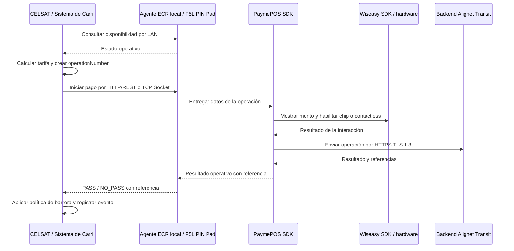

## Flujo nominal

El **Sistema de Control de Carril de CELSAT (SCC)** se comunica por LAN con la aplicación Agente ECR local instalada en el **terminal P5L PIN Pad**. El Agente ECR entrega la operación al PaymePOS SDK integrado dentro del POS. El PaymePOS SDK presenta el monto mediante el Wiseasy SDK, gestiona la interacción con el medio de pago y se comunica con el backend Alignet Transit.

El diagrama representa el flujo funcional basado en la arquitectura de referencia. La selección entre HTTP/REST o TCP Socket, el puerto local aplicable y los contratos de mensajes deben confirmarse en la referencia técnica.

## Reglas de integridad

| Capacidad | Regla | Comportamiento esperado |
| --- | --- | --- |
| Idempotencia | Reenviar una misma operación no debe producir un segundo efecto financiero. | Recuperar la operación existente. |
| Payload inconsistente | La misma clave con datos distintos no debe aceptarse como una nueva operación. | Devolver conflicto o error de validación. |
| Consulta de estado | CELSAT / Sistema de Carril debe poder resolver una operación cuyo resultado no recibió. | Consultar por `operationNumber` o `transactionId`, según defina la referencia técnica. |
| Recuperación | Antes de retransmitir o reemplazar una misma solicitud lógica, CELSAT / Sistema de Carril consulta la referencia previa. | Evitar doble cobro. |
| Cancelación | Cerrar una solicitud antes de que la interacción haya superado el punto permitido. | Cancelación aceptada o resultado ya existente. |

<Warning>
  La ausencia de `result`, un timeout o una pérdida de comunicación no equivalen a `NO_PASS`.
</Warning>

## Recuperar un resultado incierto

<Steps>
  <Step title="Conservar la referencia">
    Mantén `operationNumber` y, si ya fue recibido, `transactionId`.
  </Step>
  <Step title="Restablecer la comunicación">
    Espera a que el canal local o externo necesario vuelva a estar disponible.
  </Step>
  <Step title="Consultar antes de reintentar">
    Recupera el último estado conocido de la referencia previa.
  </Step>
  <Step title="Aplicar el resultado recuperado">
    Usa `PASS` o `NO_PASS` únicamente cuando la consulta devuelva una decisión operativa.
  </Step>
  <Step title="Aplicar la política acordada">
    Si el resultado continúa incierto, sigue la política de barrera definida conjuntamente. No infieras `NO_PASS`.
  </Step>
</Steps>

## Flujos de excepción

<AccordionGroup>
  <Accordion title="Pérdida de comunicación local" icon="link-slash">
    Al recuperar la conexión, el sistema de control de carril consulta la operación previa antes de reintentar. El objetivo es evitar duplicidad.
  </Accordion>
  <Accordion title="Vehículo abandona antes de presentar el medio de pago" icon="car-side">
    El sistema de carril solicita cerrar o cancelar la operación si todavía es posible. El punto técnico hasta el cual procede la cancelación queda pendiente.
  </Accordion>
  <Accordion title="Resultado no recibido" icon="clock">
    El sistema de carril conserva `operationNumber`, consulta el último estado conocido y no interpreta el timeout como `NO_PASS`.
  </Accordion>
  <Accordion title="P5L PIN Pad no disponible" icon="terminal">
    El sistema de carril detecta la indisponibilidad antes de iniciar el pago y aplica su política operativa.
  </Accordion>
  <Accordion title="Indisponibilidad WAN" icon="wifi-exclamation">
    La comunicación local permanece conceptualmente separada de la salida externa. El comportamiento se regirá por una política operativa que todavía debe acordarse.
  </Accordion>
</AccordionGroup>

## Capas de software dentro del P5L PIN Pad

El P5L PIN Pad ejecuta una aplicación Agente ECR local que recibe las solicitudes de CELSAT. Dentro de esta aplicación, el PaymePOS SDK de Alignet contiene la lógica de pago y utiliza el Wiseasy SDK para acceder al hardware del POS. El PaymePOS SDK también gestiona la comunicación externa con el backend Alignet Transit.

<Warning>
  La versión de los `.aar`, la selección del protocolo local, el puerto, los métodos y los modelos aplicables a Transit se confirmarán en la referencia técnica. No asumas que todos los ejemplos del PaymePOS SDK público constituyen el contrato definitivo de esta integración.
</Warning>
