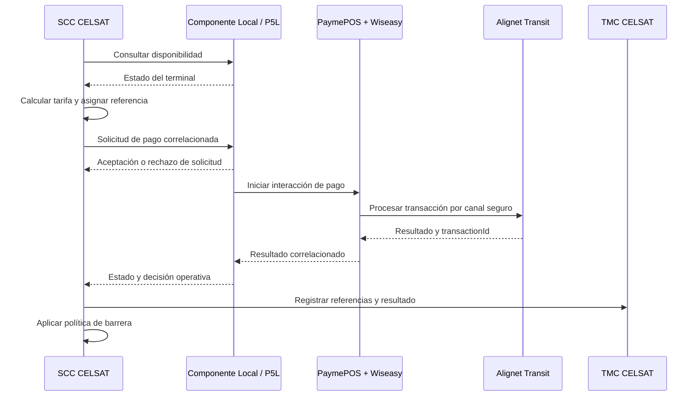
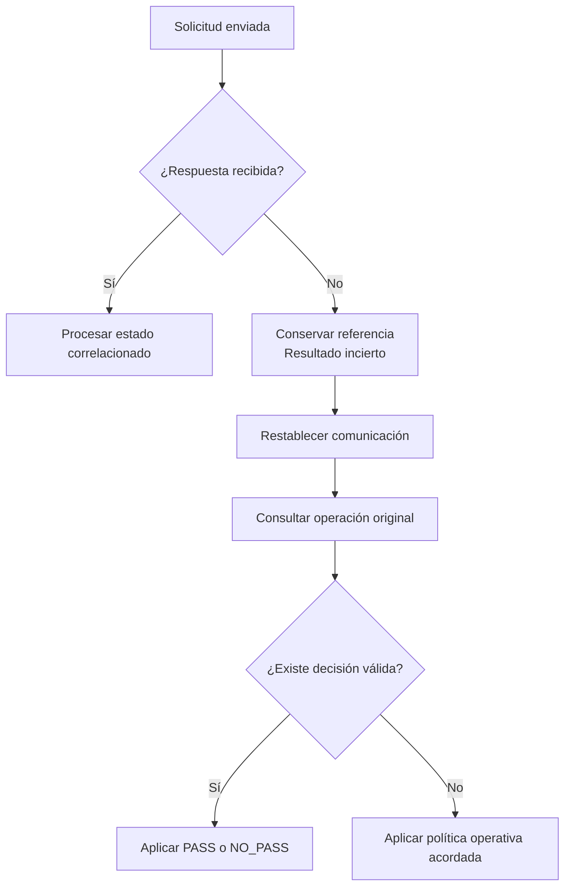

## Secuencia de referencia

El resultado puede entregarse mediante consulta, notificación o una conexión persistente. El mecanismo aplicable se registra en la especificación de interfaz acordada.

## Secuencia del lado CELSAT

<Steps>
  <Step title="Validar disponibilidad">
    Consulta el estado del terminal antes de iniciar una operación.
  </Step>
  <Step title="Persistir la referencia">
    Genera y almacena `operationNumber` junto con los datos del evento antes del envío.
  </Step>
  <Step title="Enviar la solicitud">
    Remite el monto, moneda, ubicación, categoría, sentido y fecha mediante la interfaz local.
  </Step>
  <Step title="Registrar la aceptación">
    Distingue la aceptación del mensaje del resultado final del pago.
  </Step>
  <Step title="Seguir la operación">
    Espera o consulta usando siempre la misma referencia.
  </Step>
  <Step title="Resolver el evento">
    Registra el resultado, aplica la política de barrera y genera el comprobante cuando corresponda.
  </Step>
</Steps>

## Idempotencia

| Escenario | Comportamiento esperado |
| --- | --- |
| Misma referencia y mismos datos | Recuperar la operación existente sin producir un segundo efecto financiero. |
| Misma referencia con datos distintos | Rechazar la solicitud como conflicto o inconsistencia. |
| Respuesta no recibida | Consultar la referencia original antes de retransmitir. |
| Reinicio del SCC | Recuperar referencias abiertas desde almacenamiento persistente y consultar su estado. |
| Reconexión LAN | Resolver el último estado antes de decidir otro envío. |

CELSAT debe conservar una huella de los datos relevantes asociados a `operationNumber` para detectar una reutilización inconsistente.

## Timeouts y resultado incierto

Los timeouts son parámetros configurables por ambiente. Se coordinan considerando la red, el mecanismo de respuesta y el tiempo operativo del carril.

Ante un timeout, el SCC debe:

1. conservar `operationNumber` y `transactionId`, si fue recibido;
2. registrar la operación como no resuelta, sin convertirla en `NO_PASS`;
3. restablecer la comunicación;
4. consultar el estado de la referencia original;
5. aplicar una decisión únicamente cuando sea válida;
6. ejecutar reintentos conforme a las reglas de idempotencia acordadas;
7. escalar el caso si continúa sin resolución.

## Cancelación

El SCC puede solicitar una cancelación cuando el estado lo permita. La respuesta funcional indica:

- cancelación aceptada;
- cancelación no aplicable por el estado alcanzado; o
- resultado ya disponible.

El punto operativo de no retorno y los códigos asociados se registran en la especificación de interfaz. Una respuesta de cancelación incierta debe resolverse mediante consulta.

## Manejo de errores

| Categoría | Tratamiento en el SCC |
| --- | --- |
| Validación | Corregir los datos y seguir la regla definida para la referencia. |
| Terminal ocupado o no disponible | No iniciar el pago y aplicar la política del carril. |
| Duplicado consistente | Recuperar la operación existente. |
| Duplicado inconsistente | Registrar el conflicto y no tratarlo como una operación nueva. |
| Pérdida de comunicación | Conservar la referencia y ejecutar consulta y recuperación. |
| Timeout | No inferir `NO_PASS`; consultar el estado. |
| Código desconocido | Registrar el valor original y tratar el resultado como no resuelto. |
| Error de seguridad | Detener el envío y escalar por el canal técnico acordado. |

## Logging de CELSAT

Registra, cuando se encuentren disponibles:

- `operationNumber` y `transactionId`;
- peaje, carril, categoría y sentido;
- monto y moneda;
- fecha del evento, envío y recepción;
- estado, resultado y razón;
- intentos de consulta o recuperación;
- eventos de conexión, timeout y reinicio;
- versión del contrato y terminal asociado.

No registres credenciales, PAN completo, datos EMV sensibles ni material criptográfico.
