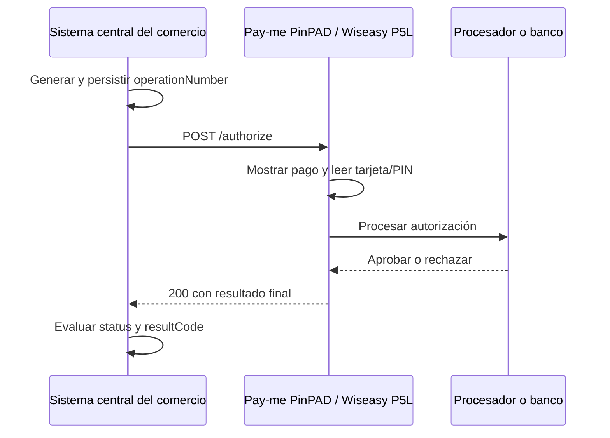
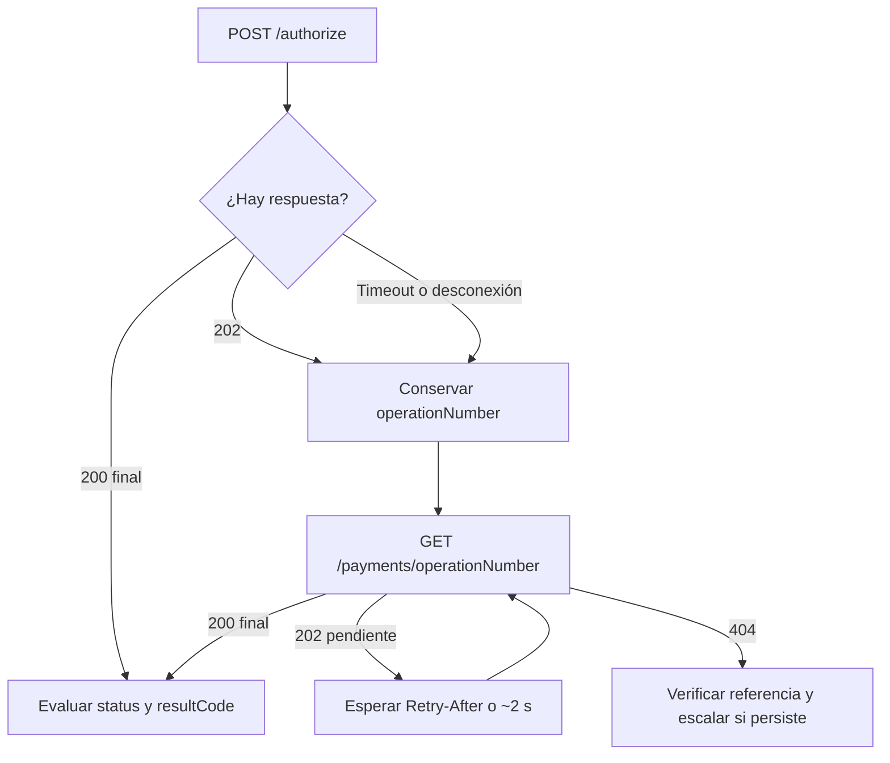

## Secuencia normal



`POST /authorize` es síncrono. La misma llamada permanece abierta mientras el usuario presenta su tarjeta e ingresa el PIN cuando corresponde.

## Timeouts

La espera interna documentada de Pay-me PinPAD es de **90 segundos** como valor de referencia en desarrollo. Este valor se ajustará antes de producción.

Configura el timeout de lectura del cliente HTTP por encima de la espera del terminal:

```text
Espera interna de Pay-me PinPAD: 90 s, referencia de desarrollo
Timeout HTTP del sistema central: al menos 100–110 s
```

Un cobro puede tomar decenas de segundos. No uses el mismo timeout corto que aplicarías a una API convencional.

<Warning>
  Si el timeout del sistema central vence antes que el del terminal, el pago puede continuar aunque el comercio haya perdido la conexión. Un timeout de red nunca equivale a rechazo.
</Warning>

El valor definitivo de la espera interna, el timeout del sistema central y el tiempo máximo de recuperación deben validarse con Alignet antes de producción.

## Recuperación de una operación incierta

Consulta cuando ocurra cualquiera de estos casos:

- `POST /authorize` devuelve HTTP `202` con `status: "PENDING"`;
- el timeout del cliente HTTP vence sin recibir respuesta;
- la conexión se interrumpe durante el cobro;
- el sistema central se reinicia con una operación abierta;
- el estado recuperado es `PROCESSING` o `UNKNOWN`.



Procedimiento:

1. Conserva el `operationNumber` original.
2. Mantén la operación como no resuelta en el sistema central.
3. No ejecutes la acción de negocio asociada ni marques un rechazo definitivo.
4. Ejecuta `GET /payments/{operationNumber}`.
5. Si recibes `202`, respeta `Retry-After`; si el header no está disponible, usa aproximadamente 2 segundos como referencia inicial.
6. Continúa hasta recibir un resultado final o alcanzar el límite operativo acordado.
7. Si alcanzas ese límite con `PENDING`, `PROCESSING` o `UNKNOWN`, escala la operación para resolución. No inicies automáticamente otro cobro.

## Idempotencia

`operationNumber` es la clave de idempotencia de Pay-me PinPAD.

| Escenario | Comportamiento garantizado |
| --- | --- |
| Misma referencia mientras se procesa | No se inicia un segundo cobro. Pay-me PinPAD responde HTTP `202` con el estado actual. |
| Misma referencia ya finalizada | No se inicia un segundo cobro. Pay-me PinPAD responde HTTP `200` con el resultado almacenado. |
| Resultado perdido por el sistema central | El sistema central puede consultar o reenviar la misma referencia para recuperar el resultado existente. |
| Nueva operación real | El sistema central debe generar una referencia nueva. |

```text
1 operación real de cobro = 1 operationNumber
```

No cambies el monto ni la moneda al reutilizar una referencia. El contrato vigente no documenta el comportamiento para una misma referencia con un payload diferente; evita esa condición y escálala si ocurre.

## Concurrencia

Pay-me PinPAD procesa una sola operación a la vez:

- Si llega el mismo `operationNumber`, aplica la regla de idempotencia.
- Si llega otro `operationNumber` mientras existe un cobro activo, responde HTTP `409` con `POS_BUSY`.
- El sistema central debe serializar los cobros destinados al mismo terminal.
- Después de `POS_BUSY`, espera a que el terminal se libere antes de reintentar la solicitud que no fue aceptada.

Si varios procesos pueden enviar pagos al mismo Wiseasy P5L, coordínalos mediante una cola o bloqueo único en el sistema central.

## Reinicios

### Reinicio del sistema central

Al iniciar, recupera de almacenamiento persistente todas las operaciones sin resultado final y consulta cada `operationNumber` antes de aceptar una decisión financiera.

### Reinicio del Wiseasy P5L durante el cobro

La operación en curso queda en `UNKNOWN`. No la marques como aprobada ni rechazada. Consulta la referencia y aplica el procedimiento de escalamiento si no alcanza un estado final.

## Flujo recomendado del sistema central

```text
1. GET /health para confirmar disponibilidad.
2. Generar y persistir un operationNumber único.
3. POST /authorize con timeout de al menos 100–110 s.
4. Evaluar el código HTTP, status y resultCode.
5. Confirmar solo 200 + APPROVED + 00.
6. Ante 202, timeout o desconexión, consultar la referencia original.
7. Reintentar una operación final DENIED o CANCELLED solo como una nueva venta,
   con un operationNumber nuevo y después de la decisión del usuario.
```

## Decisión de negocio

Define antes de producción qué hará el comercio ante resultados no finales. La regla segura es no confirmar la venta ni ejecutar una acción irreversible —por ejemplo, abrir una barrera— hasta recibir `APPROVED` con `resultCode: "00"`.

La política final para `PENDING` y `UNKNOWN`, incluido el escalamiento manual, requiere acuerdo entre el integrador y Alignet.

## Persistencia mínima

Guarda, cuando existan:

```text
operationNumber
amount
currency
paymentMethod
additionalFields
HTTP status
status
resultCode
resultMessage
authorizationCode
completedAt
fecha y hora de cada solicitud y respuesta
```

No almacenes datos sensibles de tarjeta.
