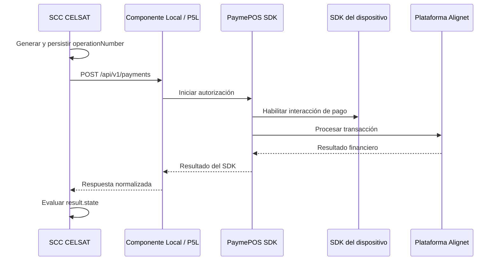
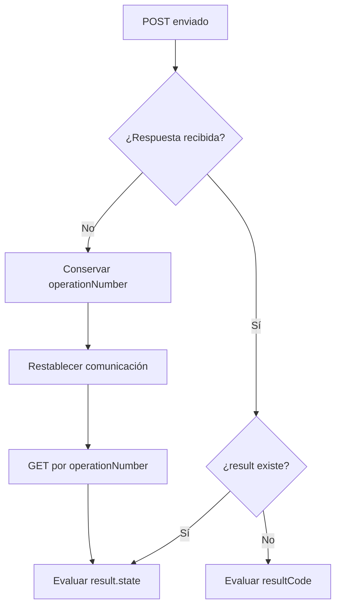

## Secuencia de autorización



El SCC inicia siempre la operación. Una vez recibida la solicitud válida, el P5L coordina la interacción de pago y devuelve una única respuesta normalizada al SCC.

## Preparación del cliente

Antes del primer envío, CELSAT debe contar con:

- acceso por red LAN al Componente Local del P5L;
- URL base del ambiente;
- mecanismo de autenticación confirmado para el ambiente;
- timeouts de conexión y lectura;
- manejo persistente de operaciones abiertas;
- lógica para interpretar el contrato de respuesta.

La URL base, el mecanismo de autenticación y los timeouts están sujetos a validación final durante la habilitación del ambiente.

## Inicialización y disponibilidad del P5L

Alignet prepara el Componente Local, PaymePOS SDK y el SDK del dispositivo antes de habilitar el P5L para las pruebas. El SCC no invoca métodos internos de inicialización.

Si el dispositivo no se encuentra preparado, la respuesta puede incluir:

| Código | Condición | Acción del SCC |
| --- | --- | --- |
| `P01` | Dispositivo no registrado | Detener el intento y solicitar revisión del terminal. |
| `P02` | Configuración requerida ausente | Detener el intento y solicitar revisión de configuración. |
| `P04` | SDK no inicializado | Detener el intento y solicitar inicialización del P5L. |

La especificación de autorización no define un endpoint de inicialización o disponibilidad para el SCC. La preparación del terminal corresponde a Alignet.

## Procesamiento de la respuesta

El SCC debe evaluar la respuesta en este orden:

1. comprobar si `result` contiene una transacción;
2. evaluar `result.state` cuando `result` exista;
3. usar `resultCode` para clasificar el resultado general o local;
4. conservar `resultMessage` y `stateReason` para diagnóstico;
5. registrar `transactionID` cuando haya sido asignado.

El pago solo se considera aprobado cuando:

```text
result.state = AUTORIZADO
```

## Consulta de estado

Cuando el resultado no sea conocido, consulta la operación mediante el mismo `operationNumber`:

```http
GET /api/v1/payments/{operationNumber}
```

Ejemplo:

```http
GET /api/v1/payments/OP-20260821-000001
```

La consulta devuelve la estructura normalizada de respuesta. Si el estado continúa como `PENDIENTE`, conserva la operación abierta y aplica la frecuencia de consulta definida para el ambiente.

## Timeout y pérdida de comunicación



Ante timeout o pérdida de comunicación, el SCC debe:

1. conservar el `operationNumber` original;
2. registrar la operación como pendiente de resolución;
3. no asumir aprobación ni rechazo;
4. restablecer la comunicación con el P5L;
5. consultar la operación original;
6. aplicar una decisión únicamente cuando la respuesta permita conocer el estado real.

## Regla crítica de reintento

<Warning>
  No generes otro `operationNumber` inmediatamente después de un timeout. Esto puede originar un segundo cobro.
</Warning>

```text
Incorrecto
OP001 → POST → timeout → crear OP002 → POST

Correcto
OP001 → POST → timeout → GET /api/v1/payments/OP001
```

La estrategia y frecuencia de reintento técnico son parámetros sujetos a ajuste durante las pruebas de integración. No implementes reintentos automáticos ilimitados.

## Idempotencia

| Escenario | Comportamiento del SCC |
| --- | --- |
| Nueva venta | Generar y persistir un nuevo `operationNumber`. |
| Timeout del `POST` | Consultar con el mismo `operationNumber`. |
| Pérdida y recuperación de la LAN | Consultar las operaciones abiertas antes de realizar nuevos envíos. |
| Reinicio del SCC | Recuperar las referencias persistidas y consultar su estado. |
| Referencia ya utilizada para otra venta | No enviar la solicitud. |

La regla base es:

```text
1 venta = 1 operationNumber
```

## Cancelaciones y extornos

Los códigos `14` y `15` indican que el usuario abandonó o canceló la interacción local. No representan una denegación del emisor.

Los códigos `P20` y `P21` pertenecen a un flujo de extorno. La especificación final de autorización no define un endpoint de cancelación o extorno para el SCC. Cualquier interfaz adicional se documentará cuando sea confirmada durante la habilitación final del ambiente.

## Tratamiento de errores

| Condición | Tratamiento recomendado |
| --- | --- |
| `result.state = AUTORIZADO` | Confirmar el pago. |
| `result.state = DENEGADO` | Informar el rechazo. |
| `result.state = PENDIENTE` | Consultar el estado. |
| `resultCode = 06` | Corregir la solicitud antes de un nuevo intento válido. |
| `resultCode = 08` | Detener la operación y solicitar revisión de configuración. |
| `resultCode = 14` o `15` | Registrar la cancelación local. |
| `resultCode = P01` a `P07` | Registrar el error, mostrar un mensaje controlado y solicitar soporte cuando corresponda. |
| Timeout o respuesta ausente | Conservar la referencia y consultar. |
| Código desconocido | Registrar el valor original y escalar sin asumir su significado. |

## Información recomendada para almacenar

Por cada operación, conserva:

```text
operationNumber
transactionID
amount
currency
success
resultCode
resultMessage
state
stateReason
authorizationCode
responseCode
fecha y hora
```

No almacenes PAN completo, CVV, PIN, PIN Block, tracks ni datos EMV sensibles.
